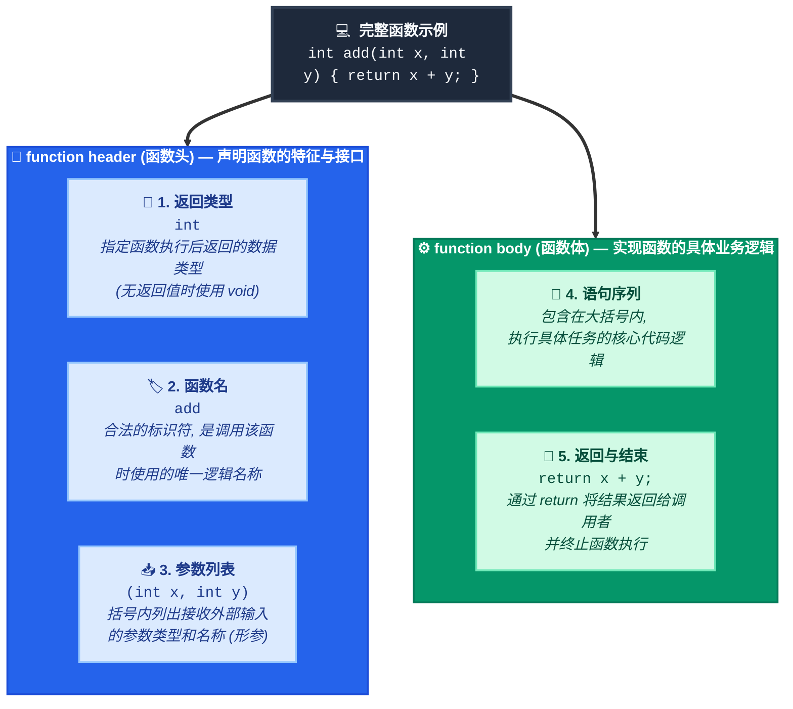
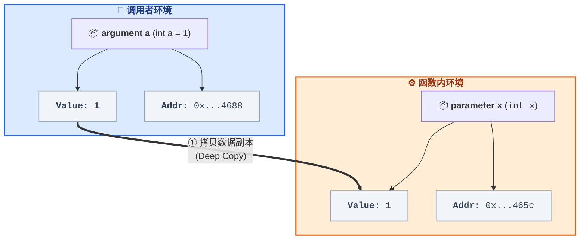
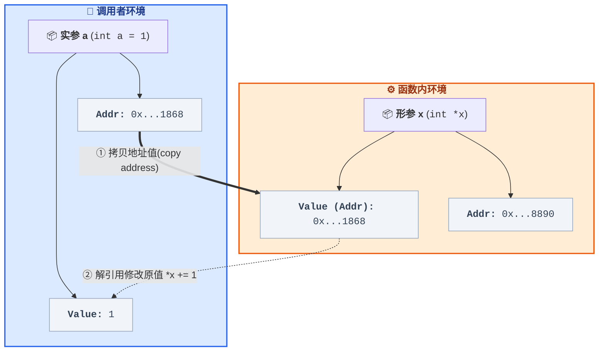
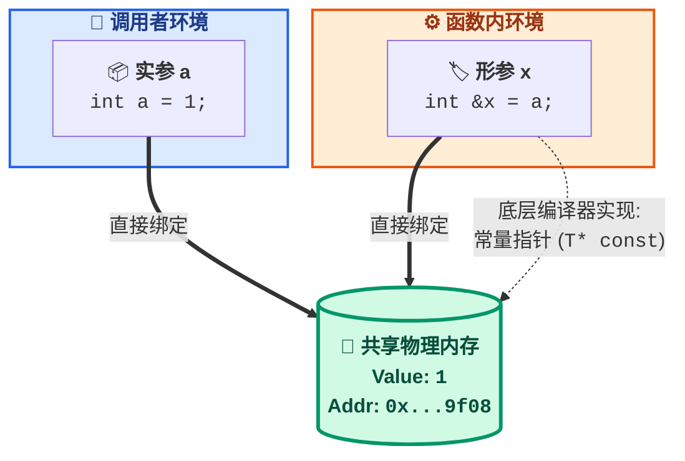

函数是执行特定任务或计算的独立代码块, 是 `c/c++` 程序的基本构建单元

## 基础概念

### 函数组成

一个完整的函数由函数头和函数体组成: 

```c
// 返回类型 函数名(参数列表)
int add(int x, int y) {
    return x + y; // 函数体
}
```

- 函数头, 由三部分组成

返回类型: 指定函数返回值类型, 可为 `void`

函数名: 标识符, 用于调用函数

参数列表: 括号内列出输入参数类型和名称

- 函数体

包含执行任务的语句序列, 并以 `return`(如果有返回值)或大括号结束

例如对于上述求和函数, 其返回类型为`int`, 函数名为`add`, 包含两个`int`类型参数



### 声明与定义

#### declaration(声明)

告知编译器函数的接口(名称、返回类型、参数), 不包含实现, 通常放在 `.h` 头文件中

```c++
// 声明add函数
// add_module.h
#ifndef __ADD_MODULE_H__
#define __ADD_MODULE_H__

int add(int x, int y);

#endif // __ADD_MODULE_H__
```

#### definition(定义)

包含函数的完整实现代码, 通常放在`.c` / `.cpp` 源文件中

```c++
#include "add_module.h"

// 定义add函数
int add(int x, int y) {
    return x + y;
}
```

- 联系

声明提供函数接口信息, 定义实现功能

二者必须保持一致: 函数名、返回类型、参数类型和顺序一致

- 区别

函数声明不分配存储空间, 只告诉编译器函数存在和接口信息

函数定义则分配存储空间, 并包含函数完整实现代码

## 参数

```c
// parameter
int add(int x, int y) {
    return x + y;
}

int a = 1;
int b = 2;

// argument
int r = add(a, b);
```

- `parameter`(`[pəˈramədər]`) 形参

函数定义中所使用的参数、占位符

用于在函数体内引用传入数据, 作用域仅在函数内部

例如示例中的`x`、`y`

- `argument`(`[ˈärɡyəmənt]`) 实参

函数调用时传入的实际值或变量, 与`parameter`一一对应

例如示例中`a`、`b`

### 参数传递

在函数调用时, `argument`值转递给`parameter`值, 传递方式分为:

#### pass by value (值传递)

调用时, 复制`argument`的副本传递给`parameter`, 函数内对`parameter`不会影响原本`argument`

值传递适用于基本数据类型(如 `int`、 `float`、 `char` 等)和`struct`, 但传递大型对象时会产生昂贵的拷贝开销

```c
#include <stdio.h>

void add(int x) {
    printf("parameter x address = %p\n", &x);
    x += 1;
}

int main() {
    int a = 1;
    printf("argument a address = %p\n", &x);

    add(a);
    printf("a = %d\n", a);

    return 0;
}
```

```sh
argument a address = 0x7ffe3a9d4688
parameter x address = 0x7ffe3a9d465c
a = 1
```

可见`argument`与`parameter`变量地址不同, 完全是两个变量, 因此函数内部对变量x的操作不会影响变量a的值



#### pass by pointer(指针传递)

本质上还是一种值传递, 函数接收变量地址, 但是可通过指针的特性使得修改`parameter`间接影响`argument`

```c
#include <stdio.h>

void add(int *x) {
    printf("parameter x value = %p\n", x);
    *x += 1;
}

int main() {
    int a = 1;
    printf("argument a address = %p\n", &a);

    add(&a);
    printf("a = %d\n", a);

    return 0;
}
```

```sh
argment a address = 0x7fffb01a1868
parameter x value = 0x7fffb01a1868
a = 2
```

`argument`和`parameter`类型为指针, 函数调用时会传递变量地址值拷贝, `parameter`可通过指针特性间接操作`argument`变量, 因此在函数内可以通过指针修改指向对象内容



#### pass by reference(引用传递)"

`c++` 特有引用传递, `parameter`是`argument`的别名, 两者共享同一块内存, 对`parameter`修改会影响`argument`



编译器通常将引用实现为常量指针(`T* const`)

在 `c++` 中, 传递大型对象且不需要修改时, 推荐使用常量引用(`const T&`) 以避免拷贝开销并保证安全性

```c
#include <iostream>

void add(int &x) {
    printf("parameter x address = %p\n", &x);
    x += 1;
}

int main() {
    int a = 1;

    printf("argment a address = %p\n", &a);
    add(a);
    printf("a = %d\n", a);

    return 0;
}
```

```sh
argment a address = 0x7ffea6489f08
parameter x address = 0x7ffea6489f08
a = 2
```

## 特殊函数类型

### inline 内联函数

使用 `inline` 关键字建议编译器在调用点直接展开函数代码, 以消除函数调用的栈帧开销, 通常用于短小且频繁调用函数

```c
inline int add(int x, int y) {
    return x + y;
}
```

> 注意: `inline` 只是对编译器的建议, 相比 C 语言的宏(`#define`), 内联函数具有类型检查和作用域优势

### lambda 表达式(c++11)

用于定义匿名函数, 常用于 `STL` 算法的回调或局部逻辑封装

```c++
auto sum = [](int a, int b) { return a + b; };
cout << sum(2, 3);
```

### 模板函数

实现泛型编程, 允许函数处理多种数据类型而无需重载

```c++
template<typename T>
T add(T a, T b) { return a + b; }
```

### 可变参数函数

允许函数接收数量不定的参数

#### c风格

缺乏类型安全, 易引发崩溃

```c
#include <stdarg.h>
```

```c++
void func(char *fmt, ...)
```

```c
#include <stdio.h>
#include <stdarg.h>

void mini_print(char *fmt, ...) {
    va_list ap;
    va_start(ap, fmt);
    for(char* p = fmt; *p; p++) {
        if(*p == '%' && *(p+1)) {
            p++;
            if(*p == 'd') printf("%d", va_arg(ap,int));
            else if(*p == 'f') printf("%f", va_arg(ap,double));
            else if(*p == 's') printf("%s", va_arg(ap,char*));
        } else putchar(*p);
    }
    va_end(ap);
}

int main() {
    mini_print("name=%s, age=%d, weight=%f\n", "dmjcb", 21, 98.2);

    return 0;
}
```

#### c++方案

`c++11` 可变参数模板: 类型安全, 支持递归展开

`c++17` 折叠表达式(fold expressions): 极大简化可变参数模板的写法

`c++20` `std::format` / `c++23` `std::print`: 完全替代 C 风格 `printf` 的现代安全方案

## stack frame(函数栈帧)

函数调用时, 系统在栈区(`stack`) 为该函数分配的一块内存区域, 称为栈帧

栈的生长方向是从高地址向低地址

### 功能

存储局部变量、函数参数

存储返回地址, 支持函数返回

支持递归与嵌套调用, 保证独立空间

### 结构

- 局部变量区: 存储函数内部定义的非静态局部变量

- 参数区: 存储传递给函数的参数(注: `x86_64` 下前 6 个整型/指针参数通常通过寄存器传递, 超出部分才压栈)

- 返回地址区: 函数执行完毕后, 程序需要返回的上一条指令地址(`rip`)

- 帧指针(`rbp`): 指向当前栈帧的底部(高地址), 用于定位局部变量和参数

- 栈指针(`rsp`): 指向当前栈帧的顶部(低地址), 随栈的分配和释放动态变化

### 函数调用过程

1. 参数传递: 将实参放入寄存器或压入栈中

2. 压入返回地址: call 指令将下一条指令地址压栈

3. 创建栈帧: 被调用函数将旧的 rbp 压栈, 并将当前 rsp 赋值给 rbp, 建立新栈帧

4. 执行与返回: 执行函数体, 返回值通常放入 rax 寄存器, 执行 ret 指令, 恢复 rbp 和 rsp, 弹出返回地址并跳转

## 调试

通过 `gdb` 可以直观地观察函数调用与栈帧变化

### 编译与启动

必须添加 `-g` 选项以生成调试符号信息

```sh
clang *.c -g -o 可执行程序
```

```sh
lldb 可执行程序
```

### 常用调试命令

#### 设置断点运行

```sh
break 函数名
```

```sh
run
```

#### 查看调用栈

使用`backtrace`(或简写为bt)命令来查看当前函数调用栈

显示一个函数调用栈列表, 包括每个函数名称和地址

#### 切换特定栈帧

使用`frame`命令来切换到特定栈帧

例如, `frame N`会切换到编号为`N`栈帧

#### 查看栈帧信息

`info frame`, 查看当前栈帧详细信息, 包括栈帧地址、大小和上一个栈帧指针等

`info args` 查看当前函数参数

`info locals` 查看当前函数局部变量

`info registers` 查看当前寄存器值

```c
#include <stdio.h>

int add(int a, int b) {
    int sum = a + b;
    return sum;
}

int main() {
    int result = add(3, 5);
    printf("result = %d\n", result);

    return 0;
}
```

编译为可执行文件

```sh
gcc main.c -c -o main
```

`gdb`调试

```sh
gdb main
```

终端输出

```sh
GNU gdb(Ubuntu 15.0.50.20240403-0ubuntu1) 15.0.50.20240403-git
Copyright(C) 2024 Free Software Foundation, Inc.
License GPLv3+: GNU GPL version 3 or later <http://gnu.org/licenses/gpl.html>
This is free software: you are free to change and redistribute it.
There is NO WARRANTY, to the extent permitted by law.
Type "show copying" and "show warranty" for details.
This GDB was configured as "x86_64-linux-gnu".
Type "show configuration" for configuration details.
For bug reporting instructions, please see:
<https://www.gnu.org/software/gdb/bugs/>.
Find the GDB manual and other documentation resources online at:
    <http://www.gnu.org/software/gdb/documentation/>.

For help, type "help".
Type "apropos word" to search for commands related to "word"...
Reading symbols from main...
(No debugging symbols found in main)
```

在main()设置断点

```sh
break main
```

终端输出

```sh
Breakpoint 1 at 0x116f
```

运行

```sh
run
```

终端输出

```sh
The program being debugged has been started already.
Start it from the beginning?(y or n) y
Starting program: /home/dmjcb/Documents/code/main
[Thread debugging using libthread_db enabled]
Using host libthread_db library "/lib/x86_64-linux-gnu/libthread_db.so.1".

Breakpoint 1, 0x000055555555516f in main()
```

显示frame

```sh
info frame
```

```sh
Stack level 0, frame at 0x7fffffffdb30:
 rip = 0x55555555516f in main; saved rip = 0x7ffff7c2a1ca
 Arglist at 0x7fffffffdb20, args:
 Locals at 0x7fffffffdb20, Previous frame's sp is 0x7fffffffdb30
 Saved registers:
  rbp at 0x7fffffffdb20, rip at 0x7fffffffdb28
```

(1) main函数被调用时, 系统会创建一个栈帧, 包含main函数局部变量和参数

(2) main函数中调用add函数时, 会将add函数参数3和5压入栈中, 并将add函数返回地址也压入栈中

(3) 系统会为Add函数创建一个新栈帧, 包含add函数局部变量(如sum)和参数(从栈中弹出3和5)

(4) add函数执行完毕后, 会将结果8放入其栈帧返回位置, 并弹出其栈帧, 返回到main函数

(5) main函数从栈中弹出add函数返回值8, 并将其存储在局部变量result中

(6) 最后main函数打印出结果并返回
