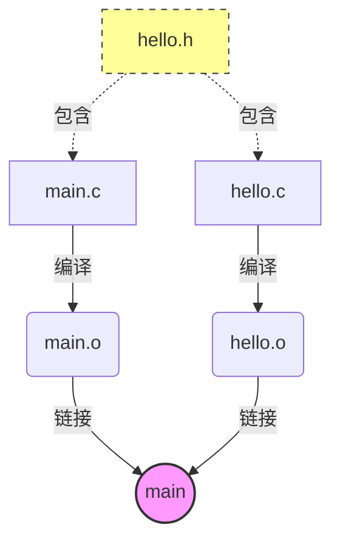

在 C/C++ 项目开发中, 随着源文件数量的增加, 手动管理编译和链接过程将变得极其繁琐

Make 是一个自动化构建工具, 而 Makefile 则是告诉 Make 该如何构建项目的规则文件

## 手动编译的痛点

```c
// hello.h
#include <stdio.h>

void hello();
```

```c
// hello.c
#include "hello.h"

void hello() {
    printf("hello!\n");
    return;
}
```

```c
// main.c
#include "hello.h"

int main() {
    hello();
    return 0;
}
```

手动编译得到可执行文件的命令如下

```sh
gcc main.c hello.c -o main
```

当项目包含成百上千个文件时, 手动输入命令是不现实的

即使只修改了 hello.c 中的一个字符, 手动编译也会全量重新编译所有文件, 极大浪费开发时间

为了解决这些问题, 需要引入 Makefile

## makefile

> ⚠️ 核心警告：在 Makefile 中, 所有规则下的命令必须以 Tab 键开头, 而不能是空格！这是新手最容易犯的错误

### 最基础的规则

```makefile
# Makefile
main: main.c hello.c
	clang hello.c main.c -o main
```

- 原理解析

make 命令不带参数时, 会默认执行 Makefile 中的第一条规则(此处为 main)

语法结构为 `目标: 依赖文件列表`

如果依赖文件（.c）的修改时间晚于目标文件（main）, Make 就会执行下方的命令

- 局限性

依然是全量编译, 没有利用中间文件（.o）进行增量编译

### 引入中间文件（增量编译）

```makefile
# 定义编译器
CC=clang

main: main.o hello.o
	$(CC) main.o hello.o -o main
hello.o:
	$(CC) -c hello.c
main.o:
	$(CC) -c main.c
```

- 原理解析

引入了 -c 参数：表示只编译不链接, 将 .c 编译为 .o（目标文件）

实现了增量编译：如果只修改了 hello.c, Make 发现 hello.o 过期, 只会重新编译 hello.o, 然后重新链接生成 main, 而不会重新编译 main.o

- 局限性

规则过于冗余, 且忽略了头文件（.h）的依赖

### 模式规则与头文件依赖

上个版本makefile如果修改了 hello.h, Make 并不会重新编译依赖它的 hello.c（注：头文件本身不参与编译, 而是被源文件包含, 此处指不会重编包含该头文件的源文件）

需要显式声明头文件依赖

```makefile
CC = gcc
DEPS = hello.h

# 模式规则：匹配所有的 .o 和 .c 文件
%.o: %.c $(DEPS)
	$(CC) -c -o $@ $<

main: main.o hello.o
	$(CC) main.o hello.o -o main
```

%.o: %.c 是模式规则（Pattern Rule）, % 是通配符, 它告诉 Make：对于任何 x.o, 它的依赖是 x.c

| 参数 | 含义                              |
| ---- | -------------------------------- |
| `$@` | 将输出文件命名为上一行`:`左边文件名 |
| `$<` | 依赖列表中首项                    |

执行`make` 后, 即可得到hello.o、main.o中间文件与main可执行文件

### 变量化与高级自动变量

使用特殊宏`$@ $^`分别表示`:`左边和右边, 进一步精简代码

```makefile
CC = gcc
CFLAGS = -Wall -g
DEPS = hello.h
OBJ = main.o hello.o

%.o: %.c $(DEPS)
	$(CC) $(CFLAGS) -c -o $@ $<

main: $(OBJ)
	$(CC) $^ -o $@
```

原理解析

$^：代表所有的依赖文件, 以空格分隔（此处为 main.o hello.o）
引入了 CFLAGS 变量, 用于存放编译选项（如 -Wall 开启警告, -g 生成调试信息)

### 依赖关系可视化

