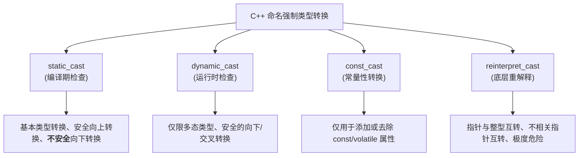

## 种类



### static_cast

用于编译期可确定的类型转换

它不进行运行时类型检查，适用于基本数据类型、指针/引用的向上转换，以及不安全的向下转换

#### 类型转换

```c++
int a = 10;
// 隐式转换也可以，但显式写出意图更清晰
double b = static_cast<double>(a); 

// 将 enum 转换为 int
enum Color { RED, GREEN };
int c = static_cast<int>(RED);
```

#### 多态类型转换

```c++
#include <iostream>

class Base { public: virtual ~Base() = default; };
class Derived : public Base { 
public: 
    void show() { std::cout << "Derived called\n"; } 
    int derived_data = 42;
};

int main() {
    Base* base = new Derived(); // 实际类型是 Derived

    // 1. 向上转换 (Upcast)：安全，其实可以隐式进行，但显式写更规范
    Base* base2 = static_cast<Base*>(new Derived()); 

    // 2. 向下转换 (Downcast)：不安全！编译器不检查实际类型
    // 程序员必须自己保证 base 实际指向的是 Derived 对象
    Derived* derived = static_cast<Derived*>(base); 
    derived->show(); // 侥幸成功，因为 base 确实是 Derived
    
    // 危险示范：
    Base* real_base = new Base();
    Derived* bad_derived = static_cast<Derived*>(real_base); // 编译通过，但运行时会导致内存越界和未定义行为
    // std::cout << bad_derived->derived_data; // 访问了不存在的内存，可能崩溃

    delete base;
    delete base2;
    delete real_base;

    return 0;
}
```

### dynamic_cast

用于运行时的安全多态类型转换。它依赖 RTTI（运行时类型信息），仅能用于包含虚函数的类（多态类型）

转换指针时：失败返回 `nullptr`

转换引用时：失败抛出 `std::bad_cast` 异常

```c++
#include <iostream>

class Base { public: virtual ~Base() = default; }; // 必须有虚函数
class Derived : public Base {};
class Other : public Base {};

int main() {
    Base* base = new Derived();

    // 1. 安全的向下转换
    if (Derived* derived = dynamic_cast<Derived*>(base)) {
        std::cout << "转换成功：base 实际是 Derived\n";
    } else {
        std::cout << "转换失败\n";
    }

    // 2. 交叉转换 (Cross-cast)
    Base* base2 = new Derived();
    Other* other = dynamic_cast<Other*>(base2); // 失败，返回 nullptr
    
    // 3. 非多态类型使用 dynamic_cast 会直接导致编译错误
    // class NoVirtual {};
    // NoVirtual* nv = dynamic_cast<NoVirtual*>(...); // 编译报错！

    delete base;
    delete base2;
    return 0;
}
```

### const_cast

用于修改对象常量性, 可添加或去除对象`const`或`volatile`属性

```c++
#include <iostream>

// 假设这是一个第三方库函数，参数被错误地声明为了 const
void legacy_print(const int* p) {
    // 我们知道传入的原始对象并不是 const 的，可以安全去除 const
    int* mutable_p = const_cast<int*>(p);
    *mutable_p = 100; // 合法操作
    std::cout << *mutable_p << "\n";
}

int main() {
    int x = 10;          // 非常量对象
    const int y = 20;    // 真正的常量对象

    legacy_print(&x);    // 合法：底层对象 x 不是 const
    // legacy_print(&y); // 危险：如果传入 y，修改 y 将导致未定义行为 (UB)！

    return 0;
}
```

### reinterpret_cast

用于底层二进制级别的强制转换

它简单地重新解释数据的位模式，不进行任何类型安全检查

```c
#include <iostream>
#include <cstdint>

struct PacketHeader {
    uint32_t id;
    uint32_t length;
};

int main() {
    // 1. 指针与整型互转 (常用于将指针存入哈希表或日志)
    int a = 10;
    uintptr_t ptr_as_int = reinterpret_cast<uintptr_t>(&a);
    int* back_to_ptr = reinterpret_cast<int*>(ptr_as_int);

    // 2. 不相关指针类型互转 (底层内存操作)
    char data[] = {0x01, 0x00, 0x00, 0x00, 0x05, 0x00, 0x00, 0x00};
    
    // 将 char 数组直接重解释为结构体指针 (需注意内存对齐和字节序问题)
    PacketHeader* header = reinterpret_cast<PacketHeader*>(data);
    std::cout << "ID: " << header->id << ", Length: " << header->length << "\n";

    return 0;
}

```