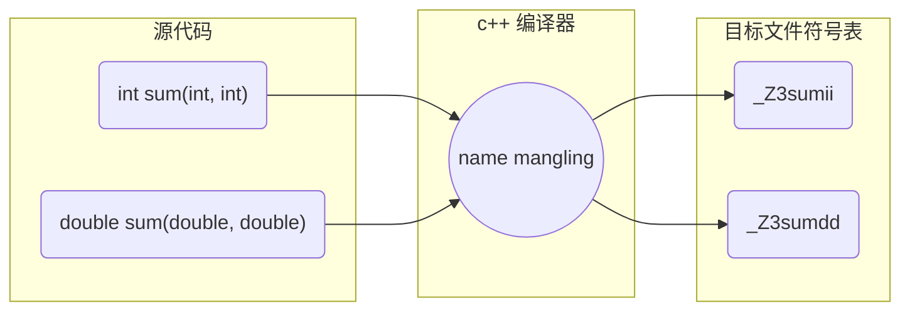
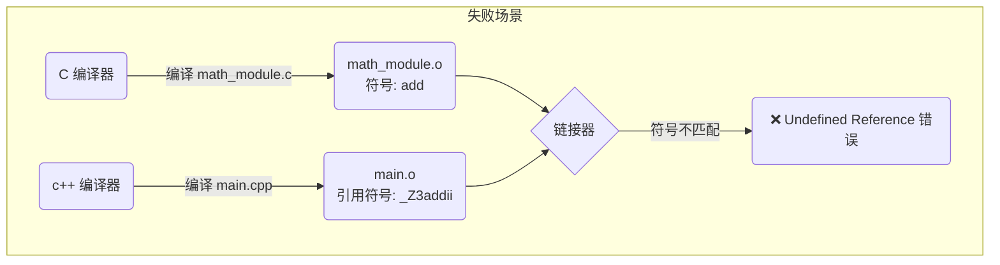

在编译和链接过程中, 代码中的函数和变量最终都会被映射为内存地址, 为方便链接器识别和定位, 编译器会将源代码中的标识符转换为唯一的符号(symbol)

链接阶段, 链接器会按照符号名来解析不同目标文件和库文件中所引用符号, 以正确区分和链接函数

在 `c` 中, 符号名通常与函数/变量名完全一致

在 `c++` 中, 为支持函数重载、类、命名空间和模板等复杂特性, 编译器引入 `name mangling`　机制

例如对于函数重载, `c++`编译器会在编译阶段通过添加参数类型、参数个数等额外信息对函数重命名, 生成唯一符号以区分同名函数



## 对比

### c

`c`无`name mangling`机制, 每个函数名称必须唯一, 链接器直接使用源代码中的名称来解析符号

```c
// c_module.c
#include <stdio.h>

int add_num(int x, int y) { return x + y; }
void display_value(double num) { printf("res = %f\n", num); }
```

编译并查看符号表

```sh
clang c_module.c -c -o c_module.o

nm c_module.o
```

发现函数符号名与源代码中名称一致

```sh
0000000000000000    T add_num
0000000000000020    T display_value
0000000000000000    r .L.str
                    U printf
```

如果在 `c` 中定义同名函数, 因无法生成唯一的符号, 编译器会直接报错定义类型冲突

```c
int add_num(int x) { return x + 1; }
double add_num(double x) { return x + 0.1; }
```

```sh
error: conflicting types for 'add_num'
```

### c++

`c++`编译器通过`name mangling`机制, 将函数的参数类型、参数个数等信息编码到符号名中

只要参数列表不同, 同名函数就能生成唯一的符号, 从而实现函数重载

```c
// cpp_module.cpp
#include <cstdio>

int add_num(int x, int y) { return x + y; }
double add_num(double x, double y) { return x + y; }

void display_value(int num) { printf("int = %d\n", num); }
void display_value(double num) { printf("double = %f\n", num); }
```

编译并查看符号表

```sh
clang++ cpp_module.cpp -c -o cpp_module.o

nm cpp_module.o
```

查看符号表, 发现同名函数的符号名被重命名成唯一符号名

```sh
                    U printf
0000000000000070    T _Z13display_valued
0000000000000040    T _Z13display_valuei
0000000000000020    T _Z7add_numdd
0000000000000000    T _Z7add_numii
```

同名函数被重命名为唯一的符号

以 `_Z7add_numii` 为例(遵循 `Itanium c++ ABI` 规则)

- `_Z`: `c++` 修饰符号的固定前缀

- `7`: 函数名长度

- `add_num`: 函数名

- `ii`: 参数类型缩写(`i` 代表 `int`)

> 如何反修饰 (demangle)？ 由于 Mangling 后的名称难以阅读, 可以使用 `c++filt` 工具将其还原
> 例如: c++filt _Z7add_numii

### c/c++ 混合编译

在实际工程中, 经常需要将 `c` 和 `c++` 代码混合编译, 这会引发符号匹配问题

#### 仅用 c++ 编译器

如果统一使用 `c++` 编译器(如 clang++)来编译 `.c` 文件, `c++` 编译器依然会对 `c`代码中的函数执行 `name mangling`

```c
// c_module.c
#include "c_module.h"

int add_num(int x, int y) { return x + y; }
void display_value(double num) { printf("res = %f\n", num); }
```

编译查看符号表

```sh
clang++ c_module.c -c -o c_module.o

nm c_module.o
```

```sh
                    U printf
0000000000000020    T _Z13display_valued
0000000000000000    T _Z7add_numii
```

#### 分别编译导致链接错误

如果 `c` 代码用 `c` 编译器编译, `c++` 代码用 `c++` 编译器编译, 在链接阶段就会发生符号未定义错误

```c
// math_module.h
#include <stdio.h>

int add(int x, int y);
```

```c
// math_module.c
#include "math_module.h"

int add(int x, int y) { return x + y; }
```

```cpp
// main.cpp
#include "math_module.h"
#include <iostream>

int main() {
    int res = add(1, 2);
    std::cout << "add = " << res << std::endl;

    return 0;
}
```

编译与链接

```sh
# 1.用c编译器编译 math_module.c
clang math_module.c -c -o math_module.o

# 2. 使用c++编译器编译 main.cpp
clang++ main.cpp.cpp -c -o main.o

# 3. 链接
clang++ math_module.o main.o -o main
```

报错

```sh
Undefined symbols for architecture arm64:
  "_Z3addii", referenced from:
      _main in main.o
```

原因分析

(1) `c`编译器编译生成`math_module.o`, 没有`name mangling`, 函数名`add`未变

(2) main.cpp 预处理时, 内容展开

```diff
+ #include <stdio.h>
+ int add(int x, int y);

#include <iostream>

int main() {
    int res = add(1, 2);
    double area = get_square_area(3.74);
    std::cout << "add = " << res << std::endl;
    std::cout << "square_area = " << area << std::endl;
    return 0;
}
```

`c++`编译器编译`main.cpp` 时, 对原本c语言函数名`add`进行`name mangling`, 生成新名`_Z3addii`

(3) 链接时`main.o`按`_Z3Addii` 符号名到各模块查找函数引用, 结果`math_module.o`里符号名是`add`, 无法匹配, 自然出现函数未定义错误



此时可 引入`extern "C"`处理

## extern "C"

`c++`编译器中提供 `extern "C"`/ `extern "C" {}` 链接指示(linkage specification)机制, 表示其后续或作用域内函数屏蔽`name mangling`机制, 按c语言风格处理

`extern "C"` 只能用于函数和全局变量声明, 不能用于类成员或模板, 其修饰函数内不能出现`c++`所有特性

### 语法

- 作用于函数

```c
extern "C" int add(int x, int y);
```

- 作用于代码块

`extern "C" {}`表示代码块内所有函数均调用`extern "C"`, 按 `c` 规则编译

```c
extern "C" {
    void func_1();
    void func_2();
    ...
}
```

### 头文件中最佳实践

在实际开发中, 为了让头文件同时兼容 `c` 和 `c++` 编译器, 通常结合预处理宏 `__cplusplus`(该宏仅在 `c++` 编译器中定义)来使用

```c++
// math_module.h
#ifndef MATH_MODULE_H
#define MATH_MODULE_H

#ifdef __cplusplus
extern "C" {
#endif

int add(int x, int y);

#ifdef __cplusplus
}
#endif

#endif // MATH_MODULE_H
```

这样, 无论是 `c` 编译器还是 `c++` 编译器包含此头文件, 都能正确识别符号

### 应用

#### c++调用c代码/静态库

在 `c++` 代码中, 使用 `extern "C"` 包裹 `c` 头文件

修改main.cpp, 对于所引用c语言头文件使用`extern "C" {}`包裹

```c++
extern "C" {
    #include "math_module.h"
}

#include <iostream>

int main() {
    int res = add(1, 2);
    std::cout << "add = " << res << std::endl;

    return 0;
}
```

因`extren C ""`机制, main.cpp中两个函数名编译时不受`name mangling`影响, 依然保持原名称, 和`math_module.o`中符号一致

链接错误问题解决

#### C 调用 C++ 代码/库

```c++
// cpp_impl.cpp
#include <iostream>
#include <string>

// 内部使用 C++ 特性
class Calculator {
public:
    static int add(int a, int b) { return a + b; }
};

// 提供给 C 调用的 C 风格接口 (使用 extern "C" 导出)
extern "C" int add_wrapper(int a, int b) {
    return Calculator::add(a, b);
}

extern "C" void print_message(const char* msg) {
    std::string cpp_msg = "C++ says: " + std::string(msg);
    std::cout << cpp_msg << std::endl;
}

```

`c` 接口头文件(供 c 代码 include)

```c++
// cpp_interface.h
#ifndef CPP_INTERFACE_H
#define CPP_INTERFACE_H

#ifdef __cplusplus
extern "C" {
#endif

// 注意：这里绝对不能出现 C++ 特有的类型(如 std::string, 自定义类等)
int add_wrapper(int a, int b);
void print_message(const char* msg);

#ifdef __cplusplus
}
#endif

#endif
```

c调用代码

```c
// main.c
#include <stdio.h>
#include "cpp_interface.h"

int main() {
    int res = add_wrapper(10, 20);
    printf("Result: %d\n", res);
    
    print_message("Hello from C!");
    return 0;
}
```

编译

```sh
clang++ cpp_impl.cpp -c -o cpp_impl.o

# c 链接 C++ 目标文件时, 需链接 c++ 标准库
clang main.c cpp_impl.o -lstdc++ -o main  
```

#### c++ 编译为动态库供 c 调用 (符号导出控制)

在 `Linux/macOS` 下, 将 `c++` 代码编译为动态库(`.so` / `.dylib`)供 `c`调用时, 默认情况下所有符号都导出

为减小库体积并隐藏内部实现, 通常使用 `-fvisibility=hidden` 隐藏所有符号, 然后显式导出需要给 `c` 调用的 `extern "C"` 接口

```c++
// mylib.cpp
#include <iostream>

// 定义导出宏, 兼容不同编译器
#if defined(_WIN32)
    #define EXPORT __declspec(dllexport)
#else
    #define EXPORT __attribute__((visibility("default")))
#endif

// 内部实现, 不导出
namespace internal {
    void do_heavy_work() { std::cout << "Working..." << std::endl; }
}

// 导出的 C 风格接口
extern "C" EXPORT void start_task(int task_id) {
    std::cout << "Starting task " << task_id << std::endl;
    internal::do_heavy_work();
}

```

编译动态库

```sh
# -fPIC: 生成位置无关代码
# -fvisibility=hidden: 默认隐藏所有符号
# -shared: 生成动态库
clang++ -fPIC -fvisibility=hidden -shared mylib.cpp -o libmylib.so
```

查看导出符号

```sh
nm -D libmylib.so | grep start_task
# 输出: 0000000000001140 T start_task  (注意：没有被 Mangling)
```

此时, `c`程序只需链接 `libmylib.so` 并包含对应的 `c` 头文件即可正常调用


#### c动态加载 c++ 动态库 (dlopen)

```c++
// host.c
#include <stdio.h>
#include <dlfcn.h>

int main() {
    // 1. 动态加载 C++ 动态库
    void* handle = dlopen("./libplugin.so", RTLD_LAZY);
    if (!handle) {
        fprintf(stderr, "dlopen error: %s\n", dlerror());
        return 1;
    }

    // 2. 获取 C 风格接口符号 (因为 C++ 使用了 extern "C", 所以符号名未被修饰)
    typedef void (*start_task_func)(int);
    start_task_func task = (start_task_func)dlsym(handle, "start_task");
    
    if (!task) {
        fprintf(stderr, "dlsym error: %s\n", dlerror());
        dlclose(handle);
        return 1;
    }

    // 3. 调用 C++ 实现的函数
    task(99);

    // 4. 卸载动态库
    dlclose(handle);
    return 0;
}
```

编译与运行

```sh
clang host.c -ldl -o host
```

> 注意：如果 C++ 动态库没有使用 extern "C", dlsym 将找不到 start_task, 因为它的实际符号名是 _Z10start_taski