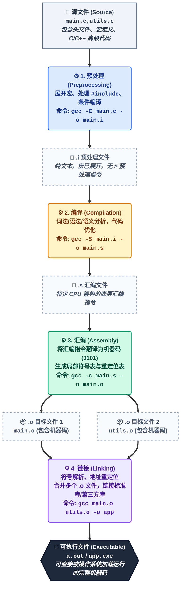
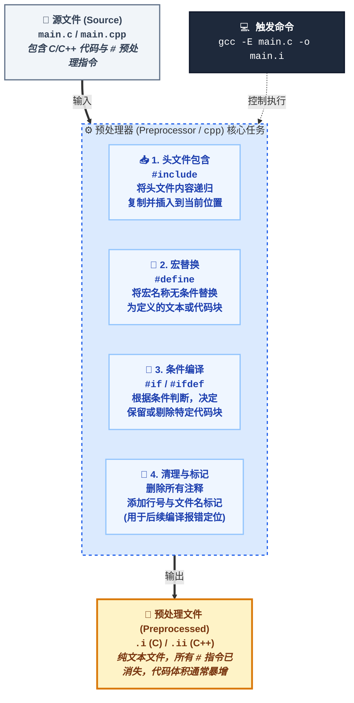
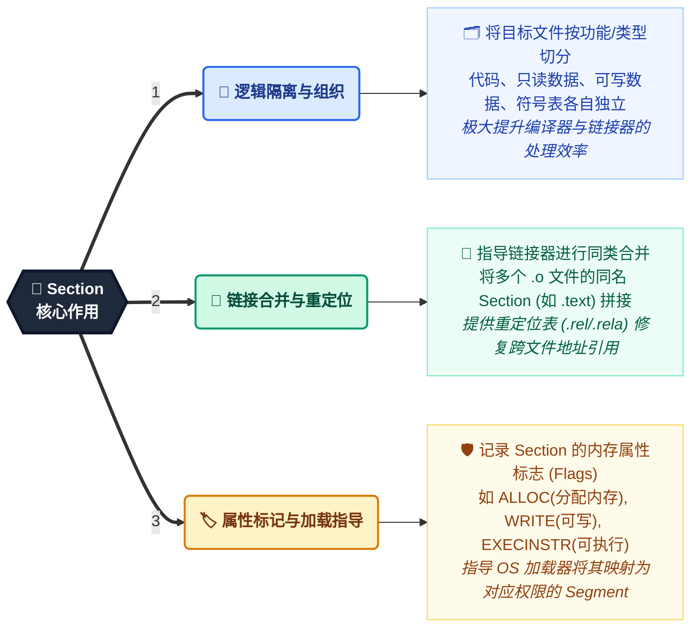
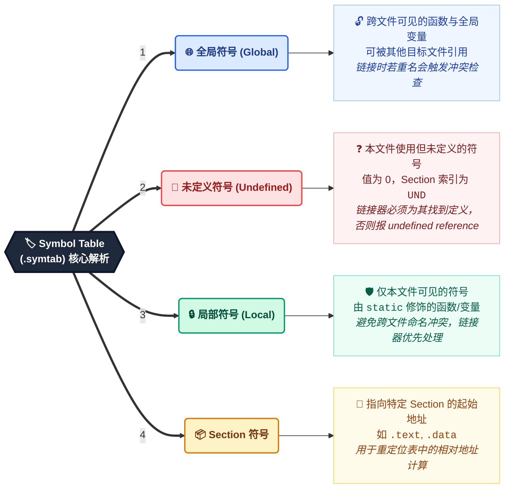
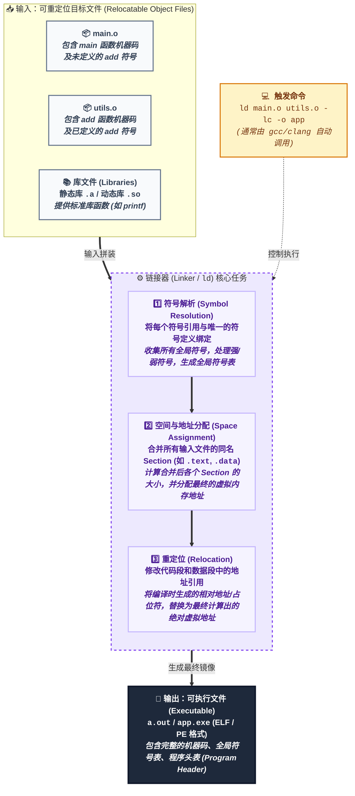
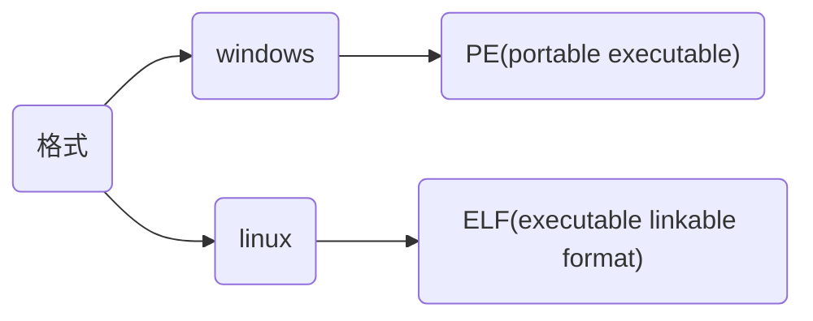
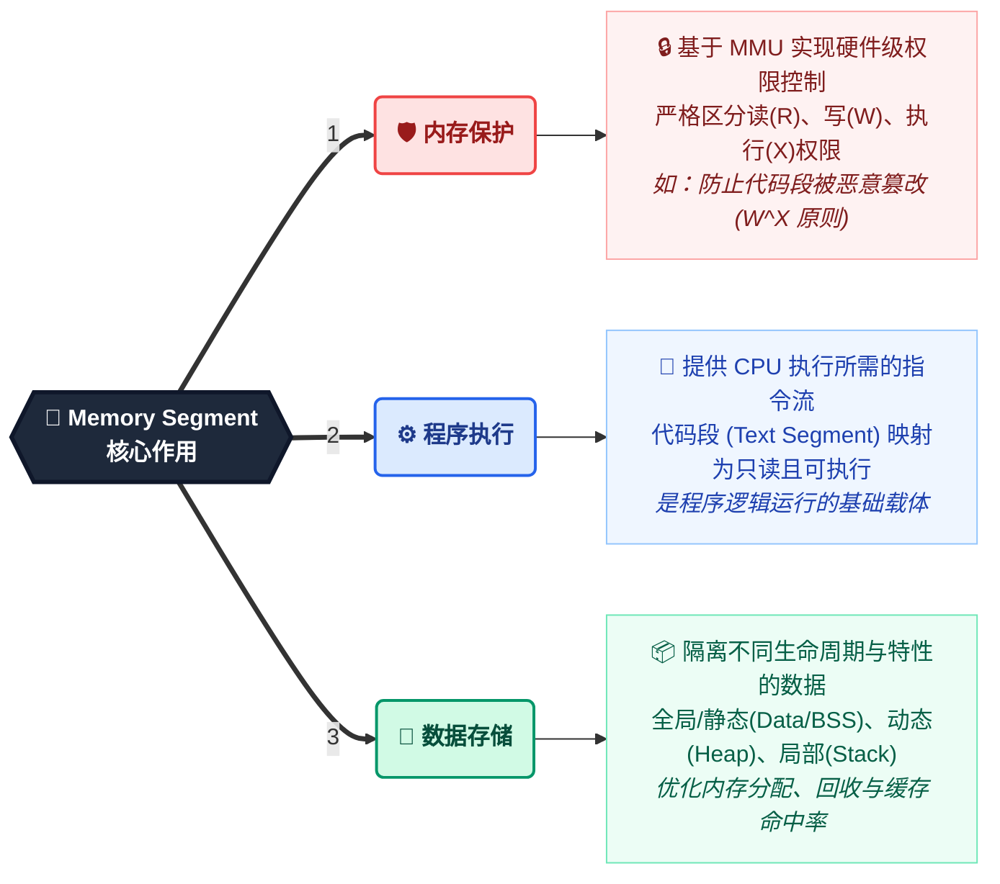
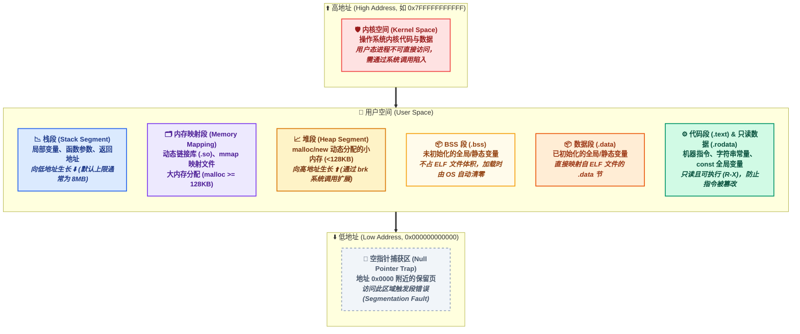
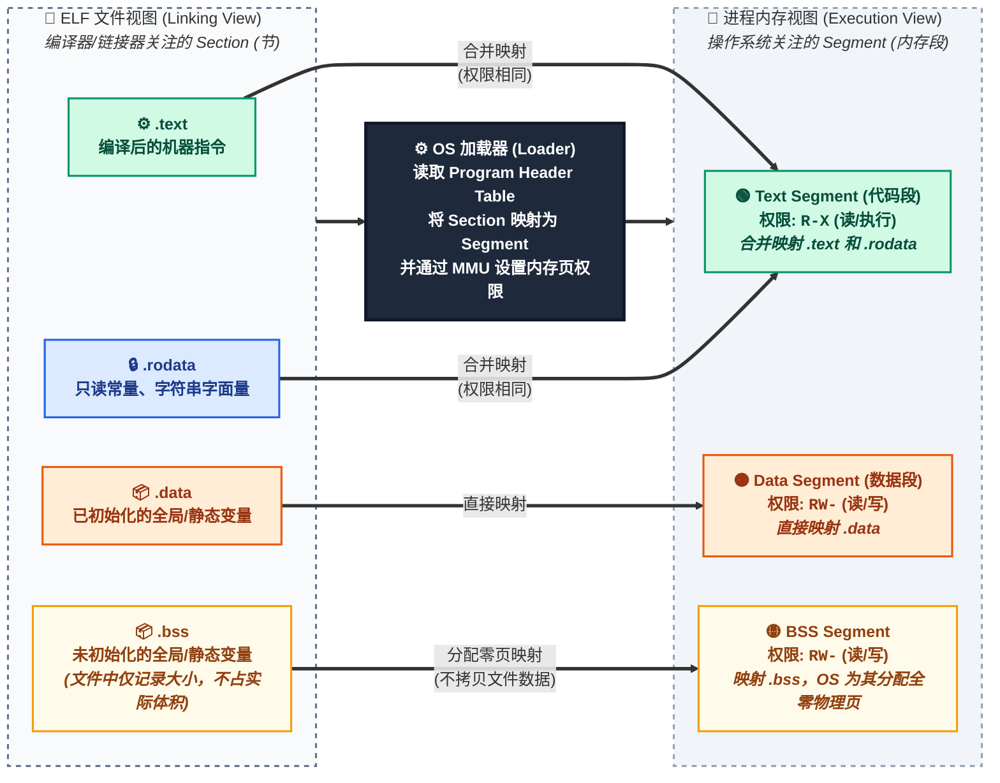

> 参考
>
> - [强符号和弱符号](https://www.cnblogs.com/zjuhaohaoxuexi/p/16221088.html)
> - [认识目标文件结构](https://cloud.tencent.com/developer/article/1449872)

`c/c++` 程序从人类可读的源代码转化为计算机可执行的机器指令, 需要经历一个复杂而精密的过程

宏观上, 这个过程可以概括为四个主要阶段: 



## preprocess(预处理)

预处理器`cpp`对源文件进行宏展开、条件编译和头文件包含等文本层面操作, 不会检查源代码语法或语义正确性, 生成`.i`预处理文件



预处理流程:

- 宏替换: 将代码中宏名称替换为对应值或代码片段

- 条件编译: 使用 `#if`、`#ifdef`、`#ifndef`、`#else`、`#elif`、`#endif` 控制编译包含内容

- 文件包含: 对于`#include ""`, 优先在当前源文件目录查找对应文件; 对于`#include <>`, 在编译器预设路径查找对于文件

- 删除注释: 移除所有 `//` 和 `/* */` 注释

- 处理 `#pragma`: 执行编译器特定的指令(如 `#pragma once` 或 `#pragma pack`)

```c
// main.c
#include <stdio.h>

int main() {
    printf("Hello World\n");
    return 0;
}
```

生成`main.i`预处理文件

```sh
clang main.c -E -o main.i
```

示例输出

```c
// main.i
# 1 "main.c"
# 1 "<built-in>" 1
# 1 "<built-in>" 3
# 389 "<built-in>" 3
......
int main() {
    printf("Hello World\n");
    return 0;
}
```

## compilation(编译)

编译器`ccl`对预处理文件进行词法分析、语法分析、语义分析及优化后生成`.s`汇编文件, 现代编译器(如 `gcc` 和 `llvm`/`clang`)在此阶段通常会经历以下子过程

```mermaid
flowchart TD
    %% 样式定义 (延续前文色彩体系)
    classDef fileNode fill:#f8fafc,stroke:#64748b,stroke-width:3px,color:#334155,font-weight:bold,font-size:16px;
    
    classDef frontend fill:#dbeafe,stroke:#2563eb,stroke-width:2px,stroke-dasharray: 5 5;
    classDef feNode fill:#eff6ff,stroke:#93c5fd,stroke-width:2px,color:#1e40af,font-weight:bold;
    
    classDef middleend fill:#fef3c7,stroke:#d97706,stroke-width:2px,stroke-dasharray: 5 5;
    classDef meNode fill:#fffbeb,stroke:#fcd34d,stroke-width:2px,color:#92400e,font-weight:bold;
    
    classDef backend fill:#d1fae5,stroke:#059669,stroke-width:2px,stroke-dasharray: 5 5;
    classDef beNode fill:#ecfdf5,stroke:#6ee7b7,stroke-width:2px,color:#065f46,font-weight:bold;

    %% 输入输出文件
    InFile["📄 <b>输入：.i 预处理文件</b><br/><i>展开后的纯 C/C++ 源代码文本</i>"]
    OutFile["📜 <b>输出：.s 汇编文件</b><br/><i>特定 CPU 架构 (如 x86/ARM) 的汇编指令文本</i>"]

    %% 前端
    subgraph Frontend ["🔍 编译器前端 (Frontend) - 与源语言相关"]
        direction TB
        Lex["1️⃣ <b>词法分析 (Lexical)</b><br/>扫描字符流，切分为 <code>Token</code><br/>(关键字、标识符、运算符)"]
        Syn["2️⃣ <b>语法分析 (Syntax)</b><br/>根据语法规则，将 Token 组装为<br/><b>AST (抽象语法树)</b>"]
        Sem["3️⃣ <b>语义分析 (Semantic)</b><br/>类型检查、作用域解析、隐式转换<br/>生成带有完整语义信息的 AST"]
        IRGen["4️⃣ <b>中间代码生成 (IR Gen)</b><br/>将 AST 降级翻译为与机器无关的<br/><b>中间表示 (IR)</b>"]
        
        Lex --> Syn --> Sem --> IRGen
    end

    %% 中端
    subgraph Middleend ["⚙️ 编译器中端 (Middle-end) - 与机器无关的优化"]
        direction TB
        Opt["5️⃣ <b>代码优化 (Optimization)</b><br/>在 IR 层面进行全局分析与优化<br/><i>(函数内联、死代码消除、循环展开、常量传播)</i>"]
    end

    %% 后端
    subgraph Backend ["🛠️ 编译器后端 (Backend) - 与目标机器相关"]
        direction TB
        TCG["6️⃣ <b>目标代码生成 (Code Gen)</b><br/><b>指令选择</b>：将 IR 映射为机器指令<br/><b>寄存器分配</b>：将虚拟寄存器映射到物理寄存器<br/><b>指令调度</b>：重排指令以优化 CPU 流水线"]
    end

    %% 连线
    InFile ==> Frontend
    Frontend ==> Middleend
    Middleend ==> Backend
    Backend ==> OutFile

    %% 应用样式
    class InFile,OutFile fileNode;
    class Frontend frontend;
    class Lex,Syn,Sem,IRGen feNode;
    class Middleend middleend;
    class Opt meNode;
    class Backend backend;
    class TCG beNode;

```



生成汇编文件`main.s`

```sh
clang main.i -S -o main.s
```

汇编片段

```asm
main:
    pushq   %rbp
    movq    %rsp, %rbp
    leaq    .L.str(%rip), %rdi
    call    printf@PLT
    popq    %rbp
    retq
.L.str:
    .asciz  "Hello World\n"
```

### 词法分析(Lexical Analysis)

编译器逐字符扫描源代码, 根据词法规则将字符流转换为有意义的记号(Token)

例如, int a = 10; 会被分解为: 关键字 int、标识符 a、运算符 =、整数常量 10、分隔符

>💡 调试技巧: 可以使用 `clang -fsyntax-only -Xclang -dump-tokens` test.c 查看词法分析输出的 `token` 流

#### 词法分析器(lexical analyzer)

编译器或解释器中组成部分, 通常使用正则表达式、状态机、有限自动机(如DFA或NFA)或手动编写解析逻辑来实现, 以高效地识别和处理源代码中字符序列

任务是将输入源代码字符串转换成有意义`token`, 通常包括关键字、标识符、常量、运算符和分隔符等

```c
int main() {
    int a = 10;
    return 0;
}
```

(1) 读取`int`

识别`int`是关键字, 生成类型为`关键字token`, 值为`int`

(2) 读取`main`

识别`main`是标识符(因为不是关键字), 生成类型为`标识符token`, 值为`main`

(3) 读取`(`和`)`

识别`(`和`)`是分隔符, 生成类型为`分隔符token`, 值分别为`(`和`)`

(4) 读取`{`

识别`{`是分隔符, 生成类型为`分隔符token`, 值为`{`

(5) 读取`int a = 10;`

识别并生成关键字`int`、标识符`a`、运算符`=`、字面量`10`(类型为"整数常量")、分隔符`;`

(5) 读取`return 0;`

识别并生成关键字`return`、字面量`0`(类型为"整数常量")、分隔符`;`

(7) 读取`}`

识别`}`是分隔符, 生成类型为`分隔符`标记, 值为`}`

词法分析结果: 

| 类型     | 值       |
| -------- | -------- |
| 关键字   | `int`    |
| 标识符   | `main`   |
| 分隔符   | `(`      |
| 分隔符   | `)`      |
| 分隔符   | `{`      |
| 关键字   | `int`    |
| 标识符   | `a`      |
| 运算符   | `=`      |
| 整数常量 | `10`     |
| 分隔符   | `;`      |
| 关键字   | `return` |
| 整数常量 | `0`      |
| 分隔符   | `;`      |
| 分隔符   | `}`      |

输出源文件中每个记号详细信息, 包括记号类型、位置和值

```c
// test.c
int main() {
    int a = 10;
    return 0;
}
```

```sh
clang -fsyntax-only -Xclang -dump-tokens test.c
```

`-fsyntax-only`指示clang仅执行语法和词法分析

`-Xclang -dump-tokens`让clang在词法分析阶段输出记号信息

输出

```sh
int 'int'	 [StartOfLine]	Loc=<test.c:1:1>
identifier 'main'	 [LeadingSpace]	Loc=<test.c:1:5>
l_paren '('		Loc=<test.c:1:9>
r_paren ')'		Loc=<test.c:1:10>
l_brace '{'	 [LeadingSpace]	Loc=<test.c:1:12>
int 'int'	 [StartOfLine] [LeadingSpace]	Loc=<test.c:2:5>
identifier 'a'	 [LeadingSpace]	Loc=<test.c:2:9>
equal '='	 [LeadingSpace]	Loc=<test.c:2:11>
numeric_constant '10'	 [LeadingSpace]	Loc=<test.c:2:13>
semi ';'		Loc=<test.c:2:15>
return 'return'	 [StartOfLine] [LeadingSpace]	Loc=<test.c:3:5>
numeric_constant '0'	 [LeadingSpace]	Loc=<test.c:3:12>
semi ';'		Loc=<test.c:3:13>
r_brace '}'	 [StartOfLine]	Loc=<test.c:4:1>
eof ''		Loc=<test.c:4:2>
```

### 语法分析(syntax analysis)

编译器根据语法规则, 将标记序列组合成各类语法短语, 如表达式、语句、函数等, 并构建抽象语法树(`AST`)

- 定义文法规则

编译器定义源语言文法规则, 通常使用上下文无关文法(CFG)来表示源语言语法结构

- 构建语法分析器

编译器根据语法分析算法(如递归下降分析、`LL(1)`分析、`LR(1)`分析等)文法规则, 构建语法分析器

语法分析器负责将词法单元流转换为语法树或`AST`

- 分析词法单元流

语法分析器从词法分析器接收词法单元流, 并根据文法规则进行推导

推导过程中, 语法分析器会检查词法单元组合是否符合语法规则

- 构建语法树或`AST`

如果词法单元流组合符合语法规则, 语法分析器会构建出相应语法树或AST

树形结构反映源代码语法结构, 便于后续语义分析和代码生成阶段使用

- 处理语法错误

如果在推导过程中发现词法单元流组合不符合语法规则, 语法分析器会生成语法错误信息, 并指示出错位置

示例, 语法分析过程

```c
int add(int a, int b) {
    return a + b;
}
```

词法分析器将源代码分解为标记, 如`int`、`add`、`(`、`)`、`{`、`return`、`+`等

语法分析器根据c++文法规则, 检查标记组合是否合法, 例如检查`i`nt add(int a, int b)`是否符合函数定义语法规则

如果符合, 语法分析器会构建出相应语法树或AST

如果不符合语法规则,如缺少分号、括号不匹配等, 语法分析器会生成语法错误信息并指示出错位置

### 语义分析(semantic analysis)

语义分析主要任务是编译器对抽象语法树进行包括类型检查、函数声明与定义匹配、变量作用域等语义检查, 确保代码符合c/c++语义规则

#### 检查处理

- 类型检查

确保表达式操作数类型与操作符兼容, 验证函数调用参数类型与函数声明中参数类型匹配

- 作用域解析

确定每个标识符(如变量、函数名)在其作用域内正确引用

- 变量声明和使用一致性

管理变量生命周期和可见性

- 表达式正确性

对表达式进行更深入分析, 以确保计算结果是有效

- 控制流语句正确性

检查如`if`、`while`、`for`循环和异常处理等控制流语句正确性

#### 记录标识符信息

记录程序中所有标识符信息, 如类型、位置、作用域等, 在编译期间提供快速查找和访问这些信息机制

#### 实施特定语义规则

实现如继承、多态、模板实例化等语言特定语义规则(针对面向对象或泛型编程语言)

#### 错误报告与恢复

当发现语义错误时, 提供清晰错误信息和位置, 尽可能地恢复并继续分析, 以找出其他潜在错误

### 中间代码生成与优化 (IR & Optimization)

在某些情况下, 语义分析阶段可能会进行初步优化工作, 如常量折叠(在编译时计算常量表达式值)和死代码消除(删除永远不会被执行代码段)等

语义分析通常通过遍历抽象语法树(`AST`)来实现, 因为AST已经捕获源代码结构信息

分析器会逐个节点地检查`AST`, 执行必要类型推断和验证操作

### 目标代码生成

将优化后的 IR 转换为特定目标架构(如 x86_64, ARM)的汇编代码(.s)

## assembly(汇编)

汇编器`as`将汇编文件转换为机器语言, 并打包成目标文件(`object file`, .o)

```sh
# 生成目标文件 main.o
clang main.s -c -o main.o
```

查看符号表

```sh
0000000000000000    r .L.str
0000000000000000    T main
                    U printf
```

### 目标文件

目标文件(`object file`)是二进制格式, 能被CPU直接识别, 由源文件经过编译器预处理、编译、汇编过程生成

目标文件与可执行文件在结构与组织形式上非常类似, 只是目标文件部分变量和函数地址未确定, 不能运行

#### 结构

- `file header`(文件头)

描述整个目标文件属性, 包含文件类型、目标架构、程序入口地址、文件属性、`section table`位置及`section`数量

使用`readelf -h`查看目标文件头信息

```sh
readelf -h main.o
```

```sh
ELF 头:
  Magic:    7f 45 4c 46 02 01 01 00 00 00 00 00 00 00 00 00
  类别:                              ELF64
  数据:                              2 补码, 小端序 (little endian)
  Version:                           1 (current)
  OS/ABI:                            UNIX - System V
  ABI 版本:                          0
  类型:                              REL (可重定位文件)
  系统架构:                           Advanced Micro Devices X86-64
  版本:                              0x1
  入口点地址:                          0x0
  程序头起点:                          0 (bytes into file)
  Start of section headers:          560 (bytes into file)
  标志:                               0x0
  Size of this header:               64 (bytes)
  Size of program headers:           0 (bytes)
  Number of program headers:         0
  Size of section headers:           64 (bytes)
  Number of section headers:         11
  Section header string table index: 1
```

- `section table`

`section` 是目标文件中一个逻辑分区, 由编译器生成, 存储如代码、数据或调试信息等特定类型信息, 用于链接阶段将不同目标文件中相同类型信息合并

在`unix-like`系统使用`objdump`或windows上`dumpbin`查看目标文件中`section`信息



描述目标文件中各个`section`信息, 包括名称、长度、在文件中偏移、读写权限及其他属性

编译器、链接器和装载器都是依靠`section table`来定位和访问各个`section`属性

目标文件包含多个`section`

| 名称        | 说明                                                 |
| ----------- | --------------------------------------------------- |
| `.text`     | 存放编译后机器指令, 是执行时主要部分                   |
| `.data`     | 存放已初始化全局变量和静态变量                         |
| `.bss`      | 为未初始化全局变量和静态变量预留空间                   |
| `.rodata`   | 包含只读数据, 如常量字符串和常量值                     |
| `.debug`    | 包含调试信息(若编译时启用调试选项)                     |
| `.rel.text` | `.text` 重定位信息, 用于`.text`中地址重定位            |
| `.rel.data` | `.data` 重定位信息, 用于对被模块使用或定义全局变量重定位 |

- `symbol table`(符号表)

记录目标文件中所有`symbol`(如变量名、函数名等)名称、地址和类型信息

保存在`.symtab setcion`中, 包含`symbol`名称、值、大小、类型和绑定信息以及所在`section`等关键信息

链接阶段允许链接器解析不同目标文件间`symbol`引用



使用`readelf -s`查看符号表内容

```sh
Symbol table '.symtab' contains 6 entries:
    Num:    Value          Size Type    Bind   Vis      Ndx Name
     0: 0000000000000000     0 NOTYPE  LOCAL  DEFAULT  UND
     1: 0000000000000000     0 FILE    LOCAL  DEFAULT  ABS main.c
     2: 0000000000000000     0 SECTION LOCAL  DEFAULT    2 .text
     3: 0000000000000000    13 OBJECT  LOCAL  DEFAULT    4 .L.str
     4: 0000000000000000    37 FUNC    GLOBAL DEFAULT    2 main
     5: 0000000000000000     0 NOTYPE  GLOBAL DEFAULT  UND printf
```

- `relocation table`(重定位表)

记录需重定位`symbol`在文件中位置、类型和重定位后值等信息

链接过程中链接器会根据符号表来更新重定位表中信息, 确保程序在加载到内存时能正确访问变量和函数

- `string table`(字符串表)

以`section`形式存储目标文件中所使用字符串, 如`section`名称、变量名等

#### 分类

- `executable file`(可执行文件)

包含可直接执行程序, 例如 `linux` 下`.out`, `windows`下`.exe`

- `relocatable file`(可重定位文件)

包含代码和数据, 可被用来链接成可执行文件或者共享目标文件, 例如静态链接库

- `shared object file`(共享目标文件)

包含代码和数据

链接器可将其跟其他可重定位文件链接, 产生新目标文件

也可将其与其他可执行文件结合作为进程一部分运行, 如动态链接库

- `core dump file`(核心转储文件)

系统在进程意外终止时用与存储该进程地址空间内容以及其他信息, 如`linux`中`core dump`

## linking(链接)

函数和变量在本质上都是地址助记符, 称为`symbol`(符号)

链接器`ld`对目标文件及库文件之间所引用`symbol`进行解析, 将引用与对应`symbol`进行匹配, 使各模块能够正确衔接, 最后合并成可执行文件(executable file)



### 过程

#### 符号解析(symbol resolution)

链接器读取所有目标文件和库文件`symbol table`, 查找各目标文件中每个所引用`symbol`在何处被定义

若找到匹配`symbol`定义, 链接器会将该`symbol`地址填充到引用该`symbol`的目标文件中

若`symbol`被引用但未被定义, 链接器会报错

链接器需要为每个引用的符号找到唯一的定义, 这里必须遵循强弱符号规则: 

- 不允许有多个强符号: 如果多个目标文件定义同名的强符号(如两个文件都定义 int g_value = 10;), 链接器会报 multiple definition 错误

- 一个强符号 + 多个弱符号: 选择强符号

- 多个弱符号: 选择占用内存空间最大的那个(或取其一, 取决于具体实现)

>💡 避坑指南: 在 C 语言中, 未初始化的全局变量(如 int a;)是弱符号
> 如果 file1.c 中 int a;, file2.c 中 int a = 10;, 链接不会报错, 最终 a 的值为 10
> 但这种行为极易引发 Bug, 建议在 C 语言中使用 extern 声明, 或在 c++ 中严格避免未初始化的全局变量

#### 重定位

编译和汇编阶段, 目标文件中`symbol`地址是相对于某个基地址偏移量

链接阶段, 符号解析匹配完成后, 链接器会将目标文件中`symbol`相对地址转换为可执行文件中绝对地址, 称为重定位

#### 合并section

目标文件通常包含多个`section`(如`.text`、`.data`、`.debug`等), 链接器需要将其合并成一个可执行文件

合并仅是简单叠加, 如合并有用`section`(例如`text section`、`data section`等), 删除如重定位`section`、`section table`, 增加如程序头表等其他`section`

合并过程中链接器会考虑`section`对齐要求、内存布局等因素, 以确保可执行文件正确性和性能

#### 生成可执行文件

在完成符号解析匹配、重定位和合并`section`后, 最终生成可执行文件

可执行文件包含程序所有代码和数据, 以及必要元数据(如程序入口点、`section`信息等)

#### 问题

#### 未解析符号

如果某个符号被引用但未被定义, 链接器会报错, 通常是由于缺少相应源文件、库文件或头文件导致

- 符号冲突

符号重复定义(`multiple definition`)错误是因为在多个源文件中定义同名全局变量, 并都进行初始化

示例, 重定义错误

file_1.c 中定义全局变量 g_value

```c
int g_value = 10;
```

file_2.c 中又对 g_value 进行定义

```c
int g_value = 20;
```

链接时就会出现错误

```sh
file_2.o: multiple definition of `g_value`
file_1.o: first defined here
```

- 路径问题

如果链接器无法找到指定库文件, 会报错, 通常是由于库文件路径设置不正确或库文件未安装导致

### 类别

#### 静态链接

在程序运行前确定`symbol`地址为静态链接(`static linking`)

函数代码将从其所在静态链接库中被拷贝到最终可执行程序中, 该程序被执行时这些代码将被装入到该进程虚拟地址空间中

静态链接库实际上是一个目标文件集合, 其中每个文件含有库中一个或者一组相关函数代码

#### 动态链接

在程序运行期间再确定符号地址为动态链接(`dynamic linking`)

库文件所内符号地址是在程序运行期间确定, 所以称为动态链接库(`dynamic linking library`)

函数代码被放到动态链接库或共享对象某个目标文件中, 链接程序此时只是在最终可执行程序中记录下共享对象名字以及其它少量登记信息

可执行文件被执行时, 动态链接库全部内容将被映射到运行时相应进程虚地址空间, 根据可执行程序中记录信息找到相应函数代码执行

对比

特性    | 静态链接 (Static Linking)            | 动态链接 (Dynamic Linking)
--------|-------------------------------------|---------------------------------
时机	| 编译/链接阶段完成	                    | 程序加载或运行时完成
产物	| 生成独立的可执行文件(包含所有库代码)  |	可执行文件仅包含对动态库的引用
体积	| 文件体积较大(存在代码冗余)           | 文件体积小, 多个程序可共享同一份库代码
更新	| 库更新需重新编译链接整个程序           | 库更新后, 程序重启即可使用新版本(无需重新编译)
命令	| gcc main.c -static -o main	      | gcc main.c -o main (默认)


## 可执行文件

包含机器代码, 计算机可以直接执行以运行特定任务或程序



section vs segment对比

section: 是链接视图下的概念, 用于编译和链接阶段, 粒度较细(如 .text, .data)

segment: 是执行视图(内存视图) 下的概念, 操作系统加载程序时, 会将具有相同权限的多个 Section 合并为一个 Segment(如将 .text 和 .rodata 合并为只读的代码段 LOAD)

### 静态结构

可执行文件组织形式和目标文件非常类似

目标文件中`section table`用来描述各个`section`信息, 包括名字、长度、在文件中偏移、读写权限等, 通过其可以详细解目标文件结构

可执行文件中`section table`被删除, 以程序头表(`program header table`)取代, 系统根据程序头表将可执行文件加载到内存, 并为各个`segment`分配内存空间、确定地址

| 名称                   | 说明                                                                                |
| ---------------------- | ---------------------------------------------------------------------------------- |
| `ELF header`           | 描述文件类型、目标架构、入口点地址、程序头表位置和大小、节头表位置和大小等ELF基本信息     |
| `program header table` | 描述各segment信息, 如类型、偏移、在进程虚拟地址空间中起始地址、物理装载地址、长度、权限等 |
| `.text section`        | 存放编译后二进制代码                                                                |
| `.data section`        | 存放已初始化全局变量和静态变量                                                       |
| `.bss section`         | 存放未初始化全局变量和静态变量                                                       |
| `.rodata`              | 包含只读数据, 如常量字符串和常量值                                                   |
| `.debug`               | 包含调试信息(若编译时启用调试选项)                                                   |

#### .bss(block started by symbol)

存放程序中未初始化全局变量和静态变量

编译时分配空间, 在程序启动前由操作系统初始化为0(或NULL)

该部分在程序运行时才需要被初始化因此不占用磁盘空间

#### segment

`segment`是内存中一个连续物理分区, 在程序加载时创建, 用于存储特定类型数据或代码, 由多个权限相同 `section` 构成



在unix-like系统使用`ps`命令或windows上使用任务管理器查看进程内存段信息

- 与`section`关系

1. `section`是目标文件中逻辑分区, `segment`是内存中物理分区, 程序加载时操作系统在二者间建立映射

2. `section`和`segment`都有各自属性和访问权限, 如.text节(代码段)通常只读, 以防止代码被意外修改

3. 链接器链接各目标文件时, 会根据`section`类型和信息来合并和优化程序内存布局, 系统加载程序时根据这些信息来创建`segment`, 并将`section`映射到`segment`中

### 内存中结构

可执行文件在加载时实际上是被映射虚拟地址空间, 内存中结构如下

| 名称    | 说明                                        |
| ------- | ------------------------------------------ |
| `.text` | 存放编译后二进制代码                         |
| `.data` | 存放已初始化全局变量和静态变量                |
| `.bss`  | 存放未初始化全局变量和静态变量                |
| `stack` | 用于存储函数调用局部变量、返回地址和参数等信息 |
| `heap`  | 用于动态分配内存                            |

64位 Linux 进程虚拟地址空间布局



从 ELF 文件 (Section) 到 进程内存 (Segment) 的映射

> 💡 核心认知：编译器/链接器关注的是 section，而操作系统加载器关注的是 Segment
> 加载器会根据 ELF 文件中的程序头表 (Program Header Table)，将权限相同的 Section 合并映射为内存中的 Segment



#### .text(code segment)

存放机器指令, 通常设置为只读且可执行 (RX), 防止代码被恶意篡改

#### .data(data segment)

存放全局/静态变量

.data 包含已初始化的数据, .bss 包含未初始化的数据(OS 在加载时自动将其清零)

#### stack

由编译器自动管理, 用于函数调用

存放局部变量、寄存器上下文等

从高地址向低地址生长

速度快, 但空间有限(默认通常为 8MB), 滥用会导致栈溢出 (Stack Overflow)

#### heap

由程序员手动管理(malloc/free 或 new/delete), 从低地址向高地址生长

可通过`malloc`、`calloc`、`realloc`等或`new`、`new[]`运算符来申请堆内存, 并通过free或delete、delete[]来释放

堆内存是不连续内存区域, 生命周期由用户控制, 由操作系统用链表来管理空闲内存地址

### 加载过程

当用户在终端输入 ./main 时, 操作系统接管并启动程序

#### 启动程序

用户通过命令行或图形界面双击可执行文件触发程序执行

内核接收请求, 调用`execve()`系统调用启动程序

#### 解析文件

操作系统通过文件系统接口打开可执行文件

读取文件头, 验证格式是否正确(如ELF0x7f 45 4C 46和其他标识)如果文件格式非法, 返回错误(如"文件不可执行")

从文件头中提取关键信息, 包括文件类型(可执行文件、共享库等)、程序入口点(entry point)、`program header table`位置和大小、动态链接器位置(如果使用动态链接)等

#### 空间处理

如果装载是对已有进程执行, 系统会释放旧地址空间(如旧堆栈、代码段)

为新程序创建独立虚拟地址空间, 初始化页表结构

#### 按需加载(demand paging)

操作系统通常不一次性加载整个程序, 而是通过按需加载优化性能

遍历`segment table`, 根据segment类型和权限, 决定如何加载

`.text`通过mmap映射为只读, 确保指令不能被修改

`.data`映射为读写, 允许数据修改

分配对应虚拟内存区域, 不从磁盘读取内容, 直接清零页表初始记录segment虚拟地址到磁盘映射关系

当程序第一次访问某个页面时触发缺页异常, 操作系统将对应页面从磁盘加载到物理内存

#### 环境设置

操作系统为程序运行设置必要环境, 包括堆栈、堆和寄存器

分配用户栈内存(通常为固定大小, 如8MB)

设置参数列表(如argv)、环境变量(如PATH)、程序名等

堆初始化: 堆通常从数据段后开始, 随程序动态分配内存而增长

#### 加载动态链接库

如果程序依赖共享库(动态链接库), 动态链接器负责解析和加载

- 加载动态链接器

由可执行文件头指定动态链接器(如`/lib/ld-linux.so.2`)被加载到内存

- 解析依赖库

动态链接器读取`.dynamic`, 找到所依赖共享库路径

- 加载共享库

使用`mmap`将共享库映射到进程地址空间

- 符号解析

查找和绑定动态库中符号到程序中(如函数`printf`地址)

- 延迟绑定(`lazy binding`)

动态链接器可能延迟解析符号, 仅在程序第一次调用相关函数时解析

#### 启动

操作系统根据文件头记录入口点(`entry point`)地址, 将程序计数器(PC)设置为入口点

将堆栈指针(SP)指向初始化后用户栈

操作系统将控制权交给程序入口点, 从入口点开始, 程序按指令逐步执行
