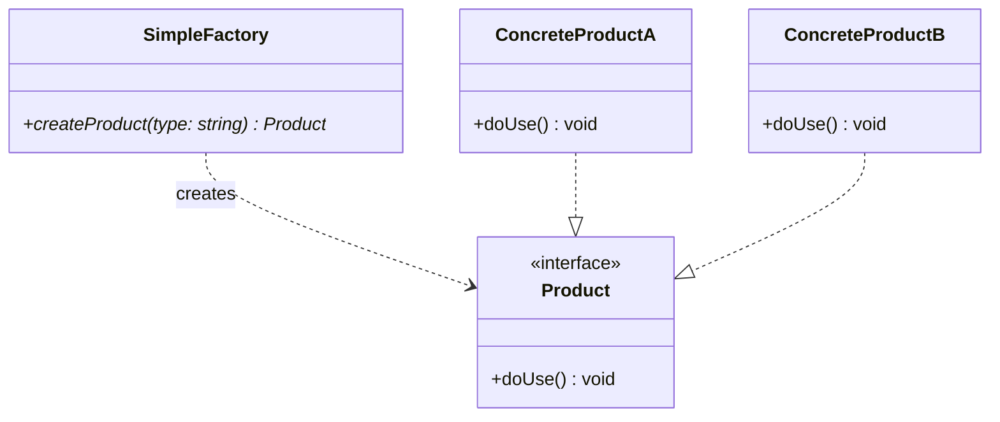
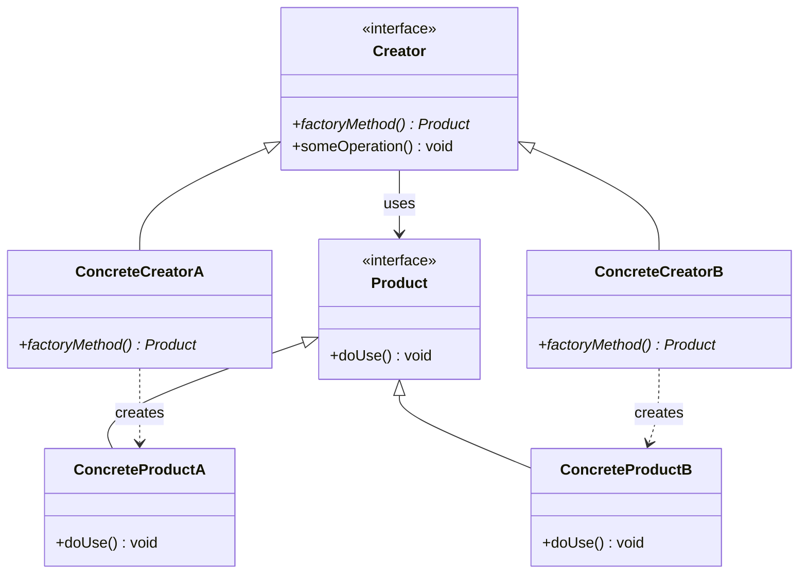
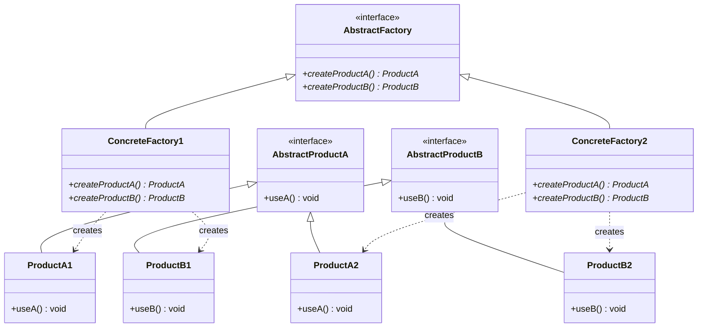

工厂模式是一种创建对象的设计模式, 其核心思想是将对象的创建与使用分离, 从而提高代码的灵活性和可维护性

工厂模式主要有以下几种形式: 简单工厂、工厂方法、抽象工厂、模板工厂

## 分类

### 简单工厂模式

将对象创建逻辑集中在一个工厂类中, 扩展性较差, 增加新产品需要修改工厂类




```c++
#include <iostream>
#include <memory>
#include <string>
#include <unordered_map>
#include <functional>

// 1. 抽象产品
class Product {
public:
    virtual ~Product() = default;
    virtual void do_use() const = 0;
};

// 2. 具体产品 A
class ConcreteProductA : public Product {
public:
    void do_use() const override {
        std::cout << "Using ConcreteProductA\n";
    }
};

// 3. 具体产品 B
class ConcreteProductB : public Product {
public:
    void do_use() const override {
        std::cout << "Using ConcreteProductB\n";
    }
};

// 4. 简单工厂 (基于注册表)
class SimpleFactory {
public:
    // 注册表: 存储 类型标识 -> 创建函数 的映射
    using CreatorFunc = std::function<std::unique_ptr<Product>()>;
    
    // 注册新产品
    static void register_product(const std::string& type, CreatorFunc func) {
        registry()[type] = std::move(func);
    }

    // 创建产品
    static std::unique_ptr<Product> create(const std::string& type) {
        auto& reg = registry();
        auto it = reg.find(type);
        if (it != reg.end()) {
            return it->second();
        }
        throw std::runtime_error("Unknown product type: " + type);
    }

private:
    // 使用 Meyer's Singleton 确保注册表全局唯一且线程安全(C++11起)
    static std::unordered_map<std::string, CreatorFunc>& registry() {
        static std::unordered_map<std::string, CreatorFunc> instance;
        return instance;
    }
};

// 辅助宏: 用于在程序启动时自动注册产品(可选的高级技巧)
#define REGISTER_PRODUCT(type, class_name) \
    static bool class_name##_registered = []() { \
        SimpleFactory::register_product(type, []() { return std::make_unique<class_name>(); }); \
        return true; \
    }()

// 注册产品
REGISTER_PRODUCT("A", ConcreteProductA);
REGISTER_PRODUCT("B", ConcreteProductB);

int main() {
    // 客户端无需知道具体类, 只需通过标识符获取
    auto product_a = SimpleFactory::create("A");
    product_a->do_use();

    auto product_b = SimpleFactory::create("B");
    product_b->do_use();

    return 0;
}
```

- 优点

客户端代码与具体产品类解耦；基于注册表的实现符合开闭原则, 新增产品只需注册, 无需修改工厂核心逻辑

- 缺点

工厂类集中了所有产品的创建逻辑, 如果产品种类极多, 工厂类会变得非常庞大("上帝类")

### 工厂方法模式

为了解决简单工厂中"工厂类过于庞大"的问题, 工厂方法模式将具体的创建逻辑延迟到了子类

它定义了一个创建对象的接口, 但由子类决定实例化哪一个类



```c++
#include <iostream>
#include <memory>

// 抽象产品
class Product {
public:
    virtual ~Product() = default;
    virtual void do_use() const = 0;
};

class ConcreteProductA : public Product {
public:
    void do_use() const override { std::cout << "Using Product A\n"; }
};

class ConcreteProductB : public Product {
public:
    void do_use() const override { std::cout << "Using Product B\n"; }
};

// 抽象工厂 (Creator)
class Creator {
public:
    virtual ~Creator() = default;
    // 工厂方法: 返回智能指针, 避免内存泄漏
    virtual std::unique_ptr<Product> factory_method() const = 0;
    
    // 业务逻辑: 使用工厂方法创建的产品
    void some_operation() const {
        auto product = factory_method();
        std::cout << "Creator doing operation with: ";
        product->do_use();
    }
};

// 具体工厂 A
class ConcreteCreatorA : public Creator {
public:
    std::unique_ptr<Product> factory_method() const override {
        return std::make_unique<ConcreteProductA>();
    }
};

// 具体工厂 B
class ConcreteCreatorB : public Creator {
public:
    std::unique_ptr<Product> factory_method() const override {
        return std::make_unique<ConcreteProductB>();
    }
};

int main() {
    // 客户端决定使用哪个具体工厂
    std::unique_ptr<Creator> creator = std::make_unique<ConcreteCreatorA>();
    creator->some_operation();

    creator = std::make_unique<ConcreteCreatorB>();
    creator->some_operation();

    return 0;
}
```

- 优点

完全符合开闭原则, 新增产品时, 只需新增对应的具体产品类和具体工厂类, 无需修改现有代码

- 缺点

每增加一个产品, 都要增加一个工厂类, 会导致系统中类的个数成对增加, 增加了系统的复杂度

### 抽象工厂模式

当系统需要创建一系列相关或相互依赖的对象(产品族) 时, 工厂方法模式就力不从心了

抽象工厂模式提供一个接口, 用于创建多个产品族中的相关对象, 而无需指定它们的具体类

>📌 核心概念区分: 
>
> 产品等级结构: 继承自同一个抽象产品的所有产品(如: 所有品牌的空调)
>
> 产品族: 由同一个工厂生产的, 属于不同产品等级结构的一组产品(如: 格力工厂生产的格力空调 + 格力电视)



```c++
#include <iostream>
#include <memory>

// ================= 产品等级结构 A: 按钮 =================
class Button {
public:
    virtual ~Button() = default;
    virtual void paint() const = 0;
};
class WinButton : public Button {
public:
    void paint() const override { std::cout << "Rendering Windows Button\n"; }
};
class MacButton : public Button {
public:
    void paint() const override { std::cout << "Rendering Mac Button\n"; }
};

// ================= 产品等级结构 B: 文本框 =================
class TextBox {
public:
    virtual ~TextBox() = default;
    virtual void paint() const = 0;
};
class WinTextBox : public TextBox {
public:
    void paint() const override { std::cout << "Rendering Windows TextBox\n"; }
};
class MacTextBox : public TextBox {
public:
    void paint() const override { std::cout << "Rendering Mac TextBox\n"; }
};

// ================= 抽象工厂 =================
class UIFactory {
public:
    virtual ~UIFactory() = default;
    virtual std::unique_ptr<Button> create_button() const = 0;
    virtual std::unique_ptr<TextBox> create_textbox() const = 0;
};

// ================= 具体工厂: Windows 产品族 =================
class WinUIFactory : public UIFactory {
public:
    std::unique_ptr<Button> create_button() const override {
        return std::make_unique<WinButton>();
    }
    std::unique_ptr<TextBox> create_textbox() const override {
        return std::make_unique<WinTextBox>();
    }
};

// ================= 具体工厂: Mac 产品族 =================
class MacUIFactory : public UIFactory {
public:
    std::unique_ptr<Button> create_button() const override {
        return std::make_unique<MacButton>();
    }
    std::unique_ptr<TextBox> create_textbox() const override {
        return std::make_unique<MacTextBox>();
    }
};

int main() {
    // 客户端只依赖抽象工厂, 保证创建出的产品族风格一致
    std::unique_ptr<UIFactory> factory = std::make_unique<MacUIFactory>();
    
    auto btn = factory->create_button();
    auto txt = factory->create_textbox();
    
    btn->paint(); // 输出 Mac 风格
    txt->paint(); // 输出 Mac 风格

    return 0;
}

```

### 模板工厂

在 C++ 中, 我们可以利用模板参数在编译期确定要创建的类型, 从而彻底消除运行时的类型判断开销(如 switch 或 dynamic_cast)

```c++
#include <iostream>
#include <memory>

class Product {
public:
    virtual ~Product() = default;
    virtual void do_use() const = 0;
};

class ProductA : public Product {
public:
    void do_use() const override { std::cout << "Using ProductA\n"; }
};

class ProductB : public Product {
public:
    void do_use() const override { std::cout << "Using ProductB\n"; }
};

// 模板工厂: 利用编译期多态
template <typename T>
class TemplateFactory {
public:
    // 约束: 确保 T 必须是 Product 的子类 (C++20 Concepts 语法, C++11 可用 static_assert)
    static std::unique_ptr<Product> create() {
        static_assert(std::is_base_of_v<Product, T>, "T must be derived from Product");
        return std::make_unique<T>();
    }
};

int main() {
    // 编译期确定类型, 无需运行时查表或 switch
    auto prod_a = TemplateFactory<ProductA>::create();
    auto prod_b = TemplateFactory<ProductB>::create();

    prod_a->do_use();
    prod_b->do_use();

    return 0;
}
```

- 优点

极致的性能(编译期解析), 类型安全, 代码极其简洁

- 缺点

无法在运行时动态决定创建哪种类型(因为模板参数必须在编译期确定), 它更适合于"已知所有可能类型, 且追求极致性能"的底层组件开发


## 对比

| 模式     | 特点                | 使用场景                    |
| -------- | ------------------ | -------------------------- |
| 简单工厂 | 集中管理对象创建     | 产品种类少、变化不频繁       |
| 工厂方法 | 子类决定创建对象     | 需要扩展新产品时             |
| 抽象工厂 | 创建一系列相关产品   | 多产品族、保证产品兼容性      |
| 模板工厂 | 通过模板生成任意产品 | 高扩展性、减少修改已有工厂代码 |


核心思想:

将对象创建与使用分离, 提高代码可维护性和灵活性

根据复杂度选择不同工厂模式: 简单工厂适合小项目, 抽象工厂适合产品族较多的复杂项目, 模板工厂适合追求高扩展性场景
