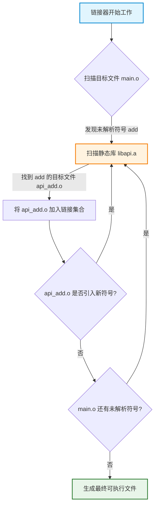
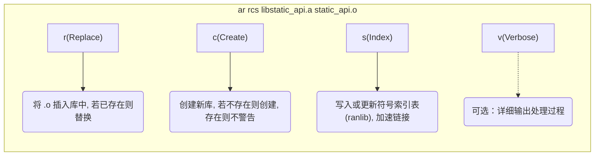

## 概念

`static library`(静态库)是一种在编译链接阶段就被完整合并到最终可执行文件中的代码库

它本质上是一个目标文件(.o)的归档集合, 当程序需要使用库中的功能时, 链接器(Linker)会将静态库中被引用的代码段"复制"并嵌入到最终的可执行文件中

- `Unix/Linux` 环境下, 扩展名通常为 `.a`(Archive)

- `Windows`环境下, 扩展名通常为 `.lib`

### 核心特性

- 编译时链接

在程序编译链接阶段, 库代码就被物理嵌入到可执行文件中

- 运行时依赖

程序运行时不需要在系统中查找或加载额外的库文件, 因为代码已经是可执行文件的一部分

- 文件体积

如果多个可执行文件都使用了同一个静态库, 库代码会被复制到每个可执行文件中, 导致整体磁盘占用和内存占用增加

- 版本控制

静态库没有运行时版本控制机制, 一旦库代码更新, 所有依赖该库的程序都必须重新编译链接才能生效

| 特性     | 静态库                           | 动态库                                   |
| -------- | ------------------------------- | ---------------------------------------- |
| 链接时间 | 编译时                           | 在运行时由操作系统加载和链接                |
| 文件大小 | 可执行文件包含库代码, 较大         | 可执行文件较小, 库文件单独                 |
| 性能     | 无需在运行时加载, 启动速度较快     | 启动时需要加载, 可能稍慢                   |
| 更新     | 更新库文件需要重新编译所有依赖程序 | 更新库文件后, 无需重新编译, 程序直接使用新库 |
| 依赖管理 | 无需在运行时寻找库文件             | 程序需要在运行时找到正确库文件             |
| 内存使用 | 每个程序包含库副本                 | 多个程序可以共享同一个动态库内存           |


## 底层链接原理



## 开发流程

> ⚠️ 避坑提示：头文件(.h / .hpp)中应尽量避免直接包含 <iostream> 等重型 C++ 标准库头文件, 这会导致包含该头文件的所有源文件编译变慢
> 应将实现细节和标准库包含放在 .cpp 中 

### 生成

```c++
// static_api.h
#ifndef STATIC_API_H
#define STATIC_API_H

// 确保在 C++ 编译时, 支持 C 语言调用(Name Mangling 兼容)
#ifdef __cplusplus
extern "C" {
#endif

int add(int x, int y);
void hello();

#ifdef __cplusplus
}
#endif

#endif // STATIC_API_H

```

```c
// static_api.cpp
#include "static_api.h"
#include <iostream> // 标准库包含放在 .cpp 中

int add(int x, int y){
    return x + y;
}

void hello(){
    std::cout << "Hello from Static Library!" << std::endl;
}
```

#### 编译与打包

在 `Linux/macOS` 下, 我们使用编译器生成目标文件, 然后使用 `ar`(Archive)工具将其打包

```sh
# 1. 编译生成目标文件(.o)
clang++ -c static_api.cpp -o static_api.o

# 2. 打包生成静态库(.a)
ar rcs libstatic_api.a static_api.o
```

`ar` 命令参数解析



```sh
clang++ static_api.cpp -c -o static_api.o

ar rcv libstatic_api.a static_api.o
```

### 构建工具

在实际工程中, 几乎不会手动敲 ar 命令, 而是使用 CMake 等构建系统

以下是符合现代 CMake(Target-based)规范的写法

```cmake
cmake_minimum_required(VERSION 3.16)
project(StaticLibDemo)

# 1. 定义静态库目标
add_library(static_api STATIC static_api.cpp)

# 2. 指定头文件搜索路径(PUBLIC 表示链接此库的目标也会继承此路径)
target_include_directories(static_api PUBLIC ${CMAKE_CURRENT_SOURCE_DIR})

# 3. 定义可执行文件目标
add_executable(main main.cpp)

# 4. 将静态库链接到可执行文件
target_link_libraries(main PRIVATE static_api)
```

## 使用

手动链接(命令行)

```c
// main.cpp
#include "static_api.hpp"

int main(void){
    hello();
    std::cout << add(0xA, 0xB)<< std::endl;

    return 0;
}
```

标准链接命令

```sh
clang++ main.cpp -L. -lstatic_api -o main
```

参数解析：

- `-L.`: 告诉链接器在当前目录(.)下搜索库文件

如果是其他路径, 如 /usr/local/lib, 则写 -L/usr/local/lib

- `-lstatic_api`：告诉链接器寻找名为 libstatic_api.a(或 .so)的库

注意：必须去掉 lib 前缀和 .a 后缀