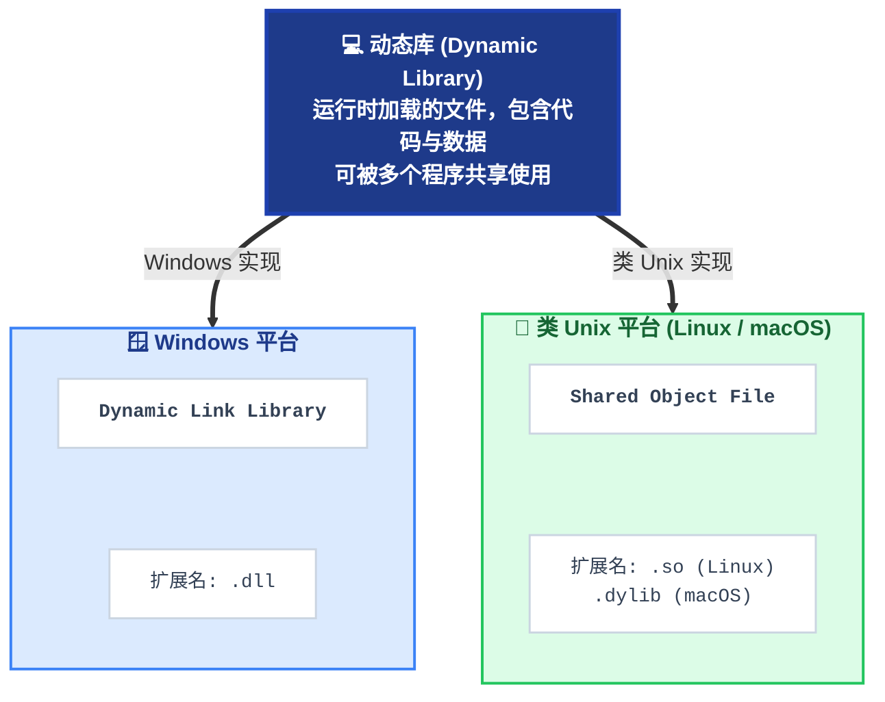
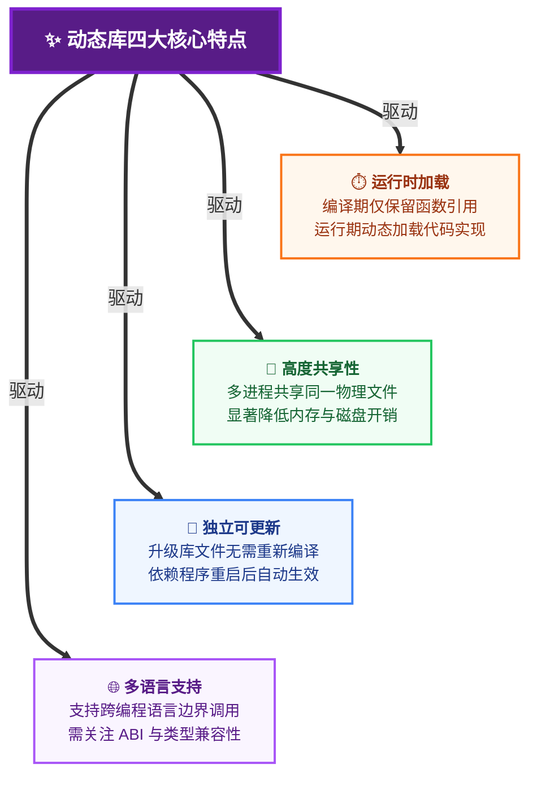
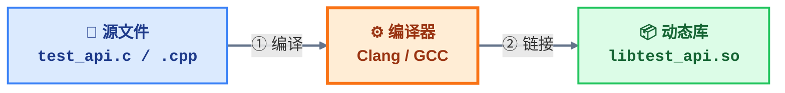
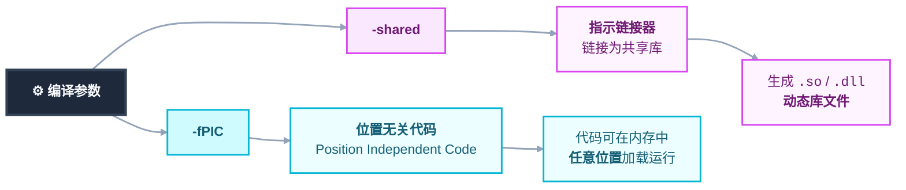
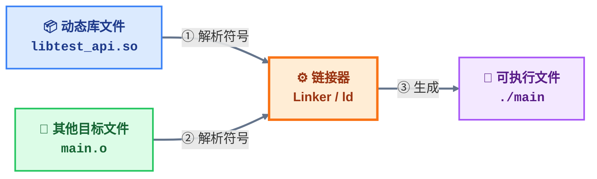
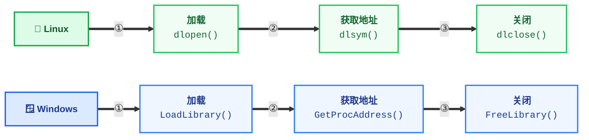

`dynamic library`(动态库)是一类在程序运行时加载的文件, 包含代码和数据, 可被多个程序共享使用

各系统中, 动态库实现方式不同:



动态库特点:



## 开发

### 关键特性

在创建`c`和`c++`动态库时有一些关键特性

#### name mangling

`c++`存在`name mangling`机制, 编译时会对所有原函数名进行修改生成唯一符号;而`c`语言无此机制

跨语言调用时, 需要用 `extern "C"` 进行屏蔽`name mangling`机制

```c++
extern "C" {
    void func();
}
```

> 注意: extern "C" 只能用于函数或全局变量, 不能用于类成员或模板

#### export symbol(导出符号)

为使库函数被外部程序调用, 需将函数标记为导出, 各平台标识如下

- `windows`: `__declspec(dllexport)`

- `linux`: `__attribute__((visibility("default")))`

```c++
#if defined(_WIN32)
    #define __EXPORT __declspec(dllexport)
#elif defined(__linux__)
    #define __EXPORT __attribute__((visibility("default")))
#endif

__EXPORT void hello();
```

### 编译流程

生成动态库`libtest_api.so`, 提供接口函数`add`、`print`

#### 编译器生成



```sh
clang -fPIC -shared test_api.c -o libtest_api.so
```



`nm`查看符号表

```sh
0000000000001110 T add
0000000000001130 T print
```

#### cmake生成

```cmake
cmake_minimum_required(VERSION 3.16)
project(test_api)

add_library(${PROJECT_NAME} SHARED "")
target_sources(${PROJECT_NAME} PUBLIC ${CMAKE_SOURCE_DIR}/test_api.c)
```

#### xmake生成

```lua
add_rules("mode.debug", "mode.release")

target("test_api")
    set_kind("shared")
    add_files("test_api.c")
```

执行`xmake`编译

#### VS生成

创建项目`test_project`、动态库项目`test_dll`, 在test_project中调用test_dll所生成动态库

```c++
// test_dll/test_dll.h
#ifndef __TEST_DLL__
#define __TEST_DLL__

#include <windows.h>
#include <iostream>

#define __EXPORT __declspec(dllexport)

#ifdef __cplusplus
extern "C" {
#endif
    __EXPORT void print_api();
    __EXPORT int app_api(int x, int y);
#ifdef __cplusplus
}
#endif

#endif
```

```c++
// test_dll/test_dll.cpp
#include "test_dll.h"

void print_api() {
    std::cout << "Hello World" << std::endl;
}

int app_api(int x, int y) {
    return x + y;
}
```

生成动态库`test_dll.dll`与动态库导入库`test_dll.lib`

`import library`(导入库)文件包含DLL中导出函数符号信息, 用于链接时解析可执行文件与动态链接库之间的函数调用关系

编译器将DLL导出函数信息提取生成导入库

- 手动调用

可手动将动态库、导入库、头文件复制到所使用项目中

将`test_dll.h` 与`test_dll.dll`、`test_dll.lib`拷贝到`test_project`项目中

修改test_project.cpp

```c++
// test_project.cpp
#include "test_dll.h"

int main() {
    print_api();

    std::cout << app_api(1, 2) << std::endl;
    return 0;
}
```

右键项目->属性->链接器->输入->附加依赖项, 添加`test_dll.lib`路径, 导入动态库

- 自动调用

设置库路径, 右键项目->属性->Vc++目录->库目录->添加库文件目录路径

设置头文件路径, 右键项目->属性->Vc++目录->包含目录->添加头文件目录路径

配置链接器, 右键项目->属性->链接器->输入->附加依赖项->选择lib文件

设置运行时依赖, 之后即可运行

## 调用

链接阶段, 链接器将动态库与目标文件链接生成可执行文件

执行阶段, 可执行文件通过隐式或显式加载动态库调用



### implicit linking(隐式调用)

编译阶段, 编译器将动态库符号和导入函数信息写入所生成中可执行文件特定区段

加载时, 系统会自动查找加载所需动态库, 并根据动态库导出表与程序中导入表相配对以确定程序使用动态库中代码位置

- 过程

(1) 调用文件包含库头文件

(2) 编译时使用`-L`指定库所在目录, 使用`-l`指定库名称(不包括前缀`lib`和后缀`.so`)

链接器ld默认库搜索路径是`/lib`和`/usr/lib`, 若库位于其他路径, 需通过设置环境变量`LD_LIBRARY_PATH`或修改`/etc/ld.so.conf`指定库搜索路径

(3) 运行程序前, 需确保动态链接库可被找到; 使用`ldd`命令可查看程序所依赖动态链接库

(4) 应用程序启动时, 操作系统会自动加载并链接动态库, 然后可调用库中所导出函数

示例, 隐式调用动态库

```c++
// main.cpp
extern "C" {
    #include "test_api.h"
}

#include <iostream>

int main(void) {
    std::cout << add(0xFF, 0xAB) << std::endl;
    print();
    return 0;
}
```

#### 编译器

```sh
clang++ 源文件 库文件 -o 可执行文件
```

调用可执行文件时, 可能报错: 

```sh
error while loading shared libraries: libtest_api.so: cannot open shared object file: No such file or directory
```

使用`ldd main`查看, 示例输出

```sh
......
libtest_api.so => not found
......
```

可通过三种方法解决: 

a. 临时使用`export LD_LIBRARY_PATH=$LD_LIBRARY_PATH:路径`, 增加动态库路径

b. 将`LD_LIBRARY_PATH=$LD_LIBRARY_PATH:路径` 添加到`~/.bashrc`

c. 也可将库文件移动到`/usr/lib`

执行后再次查看

```sh
......
libtest_api.so => (0x00007f35d9678000)
......
```

#### cmake

```cmake
# CMakeLists.txt
cmake_minimum_required(VERSION 3.16)
project(main)

add_executable(${PROJECT_NAME} "")

target_sources(${PROJECT_NAME} PRIVATE ${CMAKE_SOURCE_DIR}/main.cpp)
target_link_libraries(${PROJECT_NAME} ${CMAKE_SOURCE_DIR}/libtest_api.so)
```

### explicit linking(显式调用)

程序在运行时通过 `API` 动态加载库



```c++
// main.cpp
#include <iostream>

#if defined(_WIN32) || defined(_WIN64)
    #include <windows.h>
#elif defined(__linux__)
    #include <dlfcn.h>
#endif

typedef void(*void_func)();

int main() {
#if defined(_WIN32) || defined(_WIN64)
    HMODULE handle = LoadLibrary("libtest_api.dll");
    if (!handle) {
        std::cerr << "can not load library: " << GetLastError() << std::endl;
    }

    void_func print_func = (void_func)GetProcAddress(handle, "print");
    if (print_func == nullptr) {
        std::cerr << "can not find func: " << GetLastError() << std::endl;
        FreeLibrary(handle);
    }

#elif defined(__linux__)
    void* handle = dlopen("libtest_api.so", RTLD_LAZY | RTLD_LOCAL);
    if (!handle) {
        std::cerr << "can not load library: " << dlerror() << std::endl;
    }

    void_func print_func = (void_func)dlsym(handle, "print");
    if (print_func == nullptr) {
        std::cerr << "can not find func: " << dlerror() << std::endl;
        dlclose(handle);
    }
#endif

    print_func();

#if defined(_WIN32) || defined(_WIN64)
    FreeLibrary(handle);
#elif defined (__linux__)
    dlclose(handle);
#endif

    return 0;
}
```

#### 编译器

`linux`下需额外链接加载器库`libdl`

```sh
clang++ main.cpp -ldl -o main
```

#### cmake

```cmake
# CMakeLists.txt
cmake_minimum_required(VERSION 3.16)
project(main)

add_executable(${PROJECT_NAME} "")
target_sources(${PROJECT_NAME} PRIVATE ${CMAKE_SOURCE_DIR}/main.cpp)
if(CMAKE_HOST_SYSTEM_NAME MATCHES "Linux")
    target_link_libraries(${PROJECT_NAME} dl)
endif()
```

#### xmake

```lua
add_rules("mode.debug", "mode.release")

target("main")
    set_kind("binary")
    add_files("main.cpp")
    add_links("test_api")
    add_linkdirs(".")
    if is_os("linux") then
        add_syslinks("dl")
    end
```

### 跨语言调用

#### python

> [python ctypes(数据类型详细踩坑指南)](https://zhuanlan.zhihu.com/p/145165873)

`python`通过`ctypes`库可调用`c/c++`动态库, 但动态库函数声明中不能出现`c++`语言特性

- 示例, 生成动态库`py_api.so`并通过`python`调用

```c++
// py_api.hpp
#include <iostream>

#if defined(_WIN32)
    #define __EXPORT __declspec(dllexport)
#elif defined(__linux__)
    #define __EXPORT __attribute__((visibility("default")))
#endif

#ifdef __cplusplus
extern "C" {
#endif
    __EXPORT int add(int x, int y);
    __EXPORT void hello();
    __EXPORT int get_array_sum(int a[], int len);
    __EXPORT void swap_value(int *x, int *y);
#ifdef __cplusplus
}
#endif
```

```c++
// py_api.cpp
#include "py_api.hpp"

int add(int x, int y) {
    return x + y;
}

void hello() {
    printf("Hello World\n");
}

int get_array_sum(int a[], int len) {
    int sum = 0;
    for (int i = 0; i < len; i++) {
        sum += a[i];
    }
    return sum;
}

void swap_value(int *x, int *y) {
    int temp = *x;
    *x = *y;
    *y = temp;
}
```

生成

```sh
clang++ py_api.cpp -fPIC -shared -o libpy_api.so
```

- 加载库文件

```py
from ctypes import *

dll = cdll.LoadLibrary('./libpy_api.so')
```

- 函数调用

```py
# 加载dll
x, y = 1, 2
res = dll.add(x, y)
print(res)

dll.Hello()
```

- 数组调用

```py
# 加载dll
a = [1, 2, 3, 4, 5]
array = (c_int * 5)(*a)
res = dll.get_array_sum(array, c_int(5))
print(res)
```

- 指针调用

```py
x = pointer(c_int(0x1))
y = pointer(c_int(0xFF))

dll.swap_value(x, y)
print(x.contents)
print(y.contents)
```

## 调用规则

### 通用规则

#### 含全局变量

当动态库中包含全局变量时, 需要在头文件中使用 `extern` 声明, 表示该变量或函数在另一个文件或编译单元中定义

对于全局变量, `extern` 声明通常放在头文件中, 以便在多个源文件之间共享同个变量

```c++
// var_api.h
#ifndef __VAR_API_H__
#define __VAR_API_H__

#include <stdio.h>

// extern表示变量在其他位置定义
extern int g_version;
extern char* g_name;

#endif // __VAR_API_H__
```

```c
// var_api.c
#include "var_api.h"

int g_version = 0xABCD;

char *g_name = "abcd";
```

编译动态库

```sh
clang var_api.c -fPIC -shared -o libvar_api.so
```

查看符号表

```sh
......
0000000000004010 D g_name
0000000000004008 D g_version
.....
```

调用

```c++
// main.cpp
#include"var_api.h"
#include <iostream>

int main() {
    std::cout << g_version << std::endl;
    std::cout << g_name << std::endl;

    return 0;
}
```

```sh
clang++ main.cpp libvar_api.so -o main
```

```sh
0xABCD
abcd
```

### c语言动态库

#### 被c语言调用

一般可直接调用

```c
// c_api.h
#include <stdio.h>

int add_num(int x, int y);
```

```c
// c_api.c
#include "c_api.h"

int add_num(int x, int y) {
    return x + y;
}
```

编译

```sh
clang c_api.c -fPIC -shared -o libc_api.so
```

生成库时, 因c没有`name mangling`机制, 所以生成函数符号名仍然为`add_num`

```sh
0000000000001100 T add_num
......
```

#### 被c++调用

`c++`调用`c`语言动态库时, 需注意:

(1) 用`extern "C" {}` 包裹动态库头文件, 防止`name mangling`机制修改函数名

(2) `struct` 和 `enum` 可直接使用, 但 `c++`的 `bool` 类型和 c `int` 可能有差异

```c
// c_api.h
#include <stdio.h>

int add_num(int x, int y);
```

```c++
// main.cpp
#include"c_api.h"
#include <iostream>

int main() {
    std::cout << add_num(1, 2) << std::endl;
    return 0;
}
```

将main.cpp编译为中间文件

```sh
clang++ main.cpp -c -o main.o
```

链接

```sh
clang++ main.o libc_api.so -o main
```

报错

```sh
/usr/bin/ld: /tmp/main-6d76e7.o: in function `main':
main.cpp:(.text+0x1a): undefined reference to `add_num(int, int)'
clang++: error: linker command failed with exit code 1 (use -v to see invocation)
```

因预处理时, main.cpp展开

```diff
+ #include <stdio.h>
+ int add_num(int x, int y);
#include <iostream>
int main() {
    std::cout << add_num(1, 2) << std::endl;
    return 0;
}
```

查看libc_api.so与main.o 符号表

```sh
# nm libc_api.so
0000000000001100    T add_num
......
```

```sh
# nm main.o
0000000000000000    T main
                    U _Z7add_numii
......
```

因`c++`编译器存在`name mangling`机制, 函数符号`add_num`修改为`_Z7add_numii`, 链接时会出现同函数名符号不同问题, 导致链接失败

修改main.cpp, 增加`extern "C" {}`

```c++
// main.cpp
extern "C" {
    #include "c_api.h"
}

#include <iostream>
int main() {
    std::cout << add_num(1, 2) << std::endl;
    return 0;
}
```

预处理时, main.cpp展开

```diff
+ extern "C" {
+     #include <stdio.h>
+     int add_num(int x, int y);
+ }
#include <iostream>
int main() {
    std::cout << add_num(1, 2) << std::endl;
    return 0;
}
```

`extern "C"`屏蔽`name mangling`机制, 使`c++`编译器处理后函数名不变, 与libc_api.so中符号一致, 避免链接问题

查看main.o符号表

```sh
                    U add_num
0000000000000000    T main
......
```

同名函数符号一致, 即可正确链接

### c++动态库

- 被c++调用

`c++`调用`c++`动态库时, 需注意:

1. 只要在同一编译器下, 一般不会有 `name mangling` 的问题

2. `ABI`兼容性, 不同编译器可能有不同c++ `ABI`(如 `GCC` vs `Clang` vs `MSVC`), 导致同c++ 动态库在不同编译器下可能无法直接使用

3. 类和模板, 导出类到动态库时, 虚函数表、构造析构函数需要小心, 尽量用纯 c 风格接口, 或者提供工厂函数返回指针

4. `c++`异常可以在同编译器下传递, 但跨DLL边界需谨慎, 尤其在windows下

#### 含类动态库

若动态库含类, 生成动态库时需额外处理

```c++
// demo.hpp
#ifndef __INCLUDE_DEMO_HPP__
#define __INCLUDE_DEMO_HPP__

#include <iostream>

namespace cpp_api {
    class Demo {
        public:
            Demo() = default;
            ~Demo() = default;

            void set_value(const int val);
            void print() const;
        private:
            int m_value;
    };
} // cpp_api
#endif // __INCLUDE_CLASS_API_HPP__
```

```c++
// demo.cpp
#include "demo.hpp"

namespace cpp_api {
    void Demo::set_value(const int value) {
        this->m_value = value;
    }

    void Demo::print() const {
        std::cout << "m_value = " << m_value << std::endl;
    }
}
```

##### 类调用

以类进行调用时需在类名前增加`export symbol`, 同时所生成库仅支持c++调用

修改 demo.hpp, 增加导出符号

```c++
#ifndef __INCLUDE_DEMO_HPP__
#define __INCLUDE_DEMO_HPP__

#include <iostream>

#if defined(_WIN32)
    #define __EXPORT __declspec(dllexport)
#elif defined(__linux__)
    #define __EXPORT __attribute__((visibility("default")))
#endif

namespace cpp_api {
    class __EXPORT Demo {
    public:
        Demo() = default;
        ~Demo() = default;

        void set_value(const int val);
        void print() const;
    private:
        int m_value;
    };
}      // namespace cpp_api
#endif // __INCLUDE_DEMO_HPP__
```

生成动态库

```sh
clang++ demo.cpp -fPIC -shared -o libdemo.so
```

调用

```c++
// main.cpp
#include "demo.hpp"

int main() {
    cpp_api::Demo obj;
    obj.set_value(0xFFFF);
    obj.print();

    return 0;
}
```

##### 函数式调用

若要支持c/c++调用, 需再封装一层c适配层, 并使用`extern "C" {}`包裹函数声明

新增接口文件, 封装类所有操作

```c++
// cpp_api.hpp
#ifndef __INCLUDE_CPP_API_H__
#define __INCLUDE_CPP_API_H__

#include "demo.hpp"

#include <iostream>

#if defined(_WIN32)
    #define __EXPORT __declspec(dllexport)
#elif defined(__linux__)
    #define __EXPORT __attribute__((visibility("default")))
#endif

extern "C" {
    __EXPORT void* demo_create();
    __EXPORT void demo_destroy(void* handle);
    __EXPORT void demo_set_value(void* handle, int val);
    __EXPORT void demo_print(void* handle);
}
#endif // __INCLUDE_CPP_API_H__
```

```c++
// cpp_api.cpp
#include "cpp_api.hpp"

__EXPORT void* demo_create() {
    std::cout << "create Demo" << std::endl;
    return new cpp_api::Demo();
}

__EXPORT void demo_destroy(void* handle) {
    std::cout << "destroy Demo" << std::endl;
    delete static_cast<cpp_api::Demo*>(handle);
}

__EXPORT void demo_set_value(void* handle, int val) {
    cpp_api::Demo* obj = static_cast<cpp_api::Demo*>(handle);
    obj->set_value(val);
}

__EXPORT void demo_print(void* handle) {
    cpp_api::Demo* obj = static_cast<cpp_api::Demo*>(handle);
    obj->print();
}
```

生成动态库

```sh
clang++ demo.cpp c_api.cpp -fPIC -shared -o libc_api.so
```

调用

```c++
// main.c
#include <stdio.h>
#include "cpp_api.hpp"

int main() {
    void* handle = demo_create();

    demo_set_value(handle, 0xFFFF);
    demo_print(handle);
    demo_destroy(handle);
    return 0;
}
```

#### 含模板

动态库含模板时, 需先模板实例化, 并添加`export symbol`

```c++
// template_demo.hpp
#ifndef __INCLUDE_TEMPLATE_DEMO_HPP__
#define __INCLUDE_TEMPLATE_DEMO_HPP__

#include <iostream>

#if defined(_WIN32)
    #define __EXPORT __declspec(dllexport)
#elif defined(__linux__)
    #define __EXPORT __attribute__((visibility("default")))
#endif

template<typename T>
T sub(T x, T y);


template<typename T>
class TemplateDemo {
public:
    TemplateDemo() = default;
    ~TemplateDemo() = default;
    static T add(T x, T y);
};
#endif // __INCLUDE_TEMPLATE_DEMO_HPP__
```

```c++
// template_demo.cpp
#include "template_demo.hpp"

template<typename T>
T sub(T x, T y) {
    return T(x - y);
}

template<typename T>
T TemplateDemo<T>::add(T x, T y) {
    return T(x + y);
}

// 1.实例化模板函数, 添加导出符号
template __EXPORT int sub<int>(int, int);
template __EXPORT double sub<double>(double, double);

// 2.实例化类模板, 添加导出符号
template class __EXPORT TemplateDemo<int>;
template class __EXPORT TemplateDemo<double>;
template class __EXPORT TemplateDemo<std::string>;
```

调用

```c++
// main.cpp
#include "template_demo.hpp"
#include <iostream>

int main() {
    std::cout << sub<int>(0xA, 0xB) << std::endl;
    std::cout << sub<double>(1.234, 9.876) << std::endl;

    std::cout << TemplateDemo<int>::add(0xA, 0xB) << std::endl;
    std::cout << TemplateDemo<double>::add(1.234, 9.876) << std::endl;
    std::cout << TemplateDemo<std::string>::add("Hello", "World") << std::endl;

    return 0;
}
```

#### 被c语言调用

`c`语言若想调用`c++`动态库, 则库文件需要在导出函数名前添加`extern "C"` 或用 `extern "C" {}`包裹, 且函数声明中不能出现任何`c++`特性

### 版本管理

动态库的版本管理是指对动态链接库或共享对象文件进行版本控制, 以确保不同程序或组件可以正确地链接和使用正确的库版本

动态库的文件名中通常包含版本号信息, 以区分不同的库版本

- 示例, 动态库文件名为libtest.so.1.2.3

其中1是主版本号, 2是次版本号

#### 命令规则

设动态库名称为`libc_api.so.x.y.z`

- real name

即动态库本身名, 对于上述库

`lib`是库约定前缀

`c_api`是动态库名

`so`是库约定后缀(windows下为dll),

`x`是主版本号(`major version number`)

`y`是小版本号(`minor build version`)

`z`是编译版本号(`build version`)

- so name

即动态库别名, 上述库so name为`libc_api.so.x`

so name只关注到主版本号, 当库主版本号或次版本号发生变化时, so name也会相应地更新, 以反映新兼容性级别

客户端程序在链接时, 会指定所需so name而非具体库文件名, 即使系统上存在多版本库, 客户端程序也能正确地链接到所需版本

- link name

链接阶段所使用文件名, 格式常为`libc_api.so.x.y.z`, 它将so name和real name关联起来

#### 使用

- 示例, 创建动态库`libtest.so`, 设置so name并创建符号链接

```sh
clang++ test.o -shared -Wl,-soname,libtest.so.1 -o libtest.so.1.0
```

(1) `-Wl,-soname,libtest.so.1`

`-Wl`前缀告诉编译器将后面选项传递给链接器

`-soname` 选项设置库 so name, 即库在运行时所链接逻辑名称

(2) `-o libtest.so.1.0`

指定输出文件名称, 这里是libtest.so.1.0, 包含完整版本号

```sh
ln -s libtest.so.1.0 libtest.so.1
```

创建名为`libtest.so.1`符号链接, 指向`libtest.so.1.0`

该链接对应于库SONAME, 允许客户端程序在链接时找到正确库版本, 即使系统上存在多个版本库

```sh
ln -s libtest.so.1 libtest.so
```

创建名为`libtest.so`符号链接, 指向`libtest.so.1`, 该链接是通用名称, 用于简化库引用
