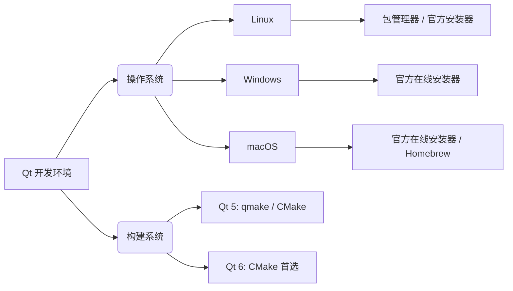

> [import QtQuick.Controls 2.0 not working - QQmlApplicationEngine failed to load component](https://stackoverflow.com/questions/38030140/import-qtquick-controls-2-0-not-working-qqmlapplicationengine-failed-to-load-c)
> [PyQT——多线程(QThread)](https://blog.csdn.net/qq_35809147/article/details/116167446)

Qt 是一个跨平台的 C++ 图形用户界面应用程序开发框架。目前 Qt 处于 Qt 5 和 Qt 6 并存的阶段：

- Qt 5.15 LTS

生态最成熟, 兼容性最好, 适合维护老项目或对稳定性要求极高的新项目

- Qt 6

现代化重构, 全面拥抱 C++17, 默认使用 CMake 构建, QML 性能大幅提升, 推荐新项目使用



## 安装

### linux

安装 Qt 5 (传统方式)

```sh
# 安装 Qt 5 基础库、开发工具、QML 及 Qt Creator
sudo apt-get update
sudo apt-get install -y build-essential cmake \
    qtbase5-dev qtchooser qt5-qmake qtbase5-dev-tools \
    qtdeclarative5-dev qtcreator

# 安装常用的 QML 运行时模块 (解决 QML 控件不显示问题)
sudo apt-get install -y qml-module-qtquick-controls2 \
    qml-module-qtquick-dialogs \
    qml-module-qtquick-layouts
```

安装 Qt 6 (推荐, 适用于 `ubuntu 22.04+`)

```sh
# 安装 Qt 6 基础库、QML 及 CMake 构建工具
sudo apt-get update
sudo apt-get install -y build-essential cmake ninja-build \
    qt6-base-dev qt6-declarative-dev qt6-tools-dev \
    qt6-tools-dev-tools libqt6opengl6-dev qtcreator
```

验证安装

```sh
# Qt 5
qmake --version

# Qt 6 (Ubuntu 下 Qt 6 的 qmake 可能名为 qmake6)
qmake6 --version 
```

### 在线安装器

如果系统包管理器的版本太旧, 或者需要安装特定的商业组件, 建议使用官方安装器

```sh
# 1. 下载在线安装器
wget https://download.qt.io/official_releases/online_installers/qt-unified-linux-x64-online.run

# 2. 赋予执行权限
chmod +x qt-unified-linux-x64-online.run

# 3. 运行 (建议配置国内镜像源以加速下载)
./qt-unified-linux-x64-online.run --mirror https://mirrors.tuna.tsinghua.edu.cn/qt
```