## 概念

### 变量模型

在 `c/c++` 中, 每个`variable/object`(变量)在源码层面和运行时层面具有以下核心属性:

- `identifier`(标识符/变量名)

源码中的变量名, 仅存在于编译期的符号表中

编译链接后, 机器码中不存在变量名, 会被替换为具体的内存地址或寄存器偏移量

其在运行时不占用内存

- `address`(地址)

变量在进程虚拟内存空间中的唯一编号(首地址)

是操作系统分配和 CPU 寻址时真正使用的物理/虚拟坐标, 存在于运行期

- `value`(值)

存储在该变量地址所标识的内存空间中的具体数据(底层为比特流)

`CPU` 根据变量数据类型(如 `int` 读 4 字节, `double` 读 8 字节), 从首地址开始读取相应长度比特流, 并将其解释为具体数值或字符

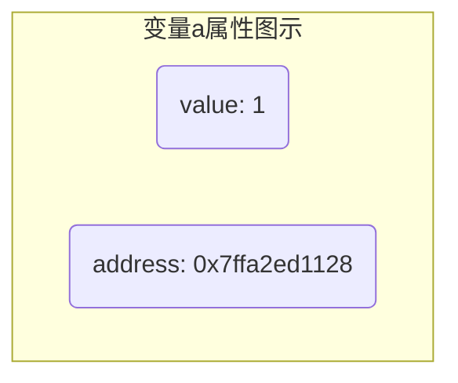

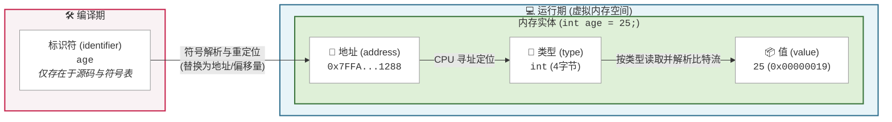

基于此, 访问变量有两种方式:

- 直接访问(`direct access`)

通过标识符读写数据, 编译器底层自动转换为地址寻址

- 间接访问(`indirect access`)

通过变量所在的内存地址读写数据, 是指针的核心机制

### 指针本质

在严谨的 `c/c++` 语境中, 必须区分指针类型与指针变量

- `pointer type`(指针类型)

一种复合数据类型(`compound type`), 与`int` `char`等基础类型平级

它定义该类型实例的内存布局(固定大小)以及允许的操作(如指针算术、解引用规则)

- `pointer variable`(指针变量)

指针类型的实例化对象, 与`int`变量 `char`变量等平级

与普通变量存储具体数据值(如整数、字符)不同, 指针变量存储的值(`value`)是另一个目标对象的内存地址(`address`)(或空指针值 `nullptr`/`NULL`)

```c
int *p_int;       // p_int 是一个指针, 专门存储 int 类型变量的地址
char *p_char;     // p_char 是一个指针, 专门存储 char 类型变量的地址
double *p_double; // p_double 是一个指针, 专门存储 double 类型变量的地址
```

> 日常使用中一般将`pointer vaiable` (指针变量)称为 `pointer`(指针)

- 指向关系(`points-to`)

当一个指针变量的值等于某个普通变量的内存地址时, 称该指针变量指向(points to)该普通变量

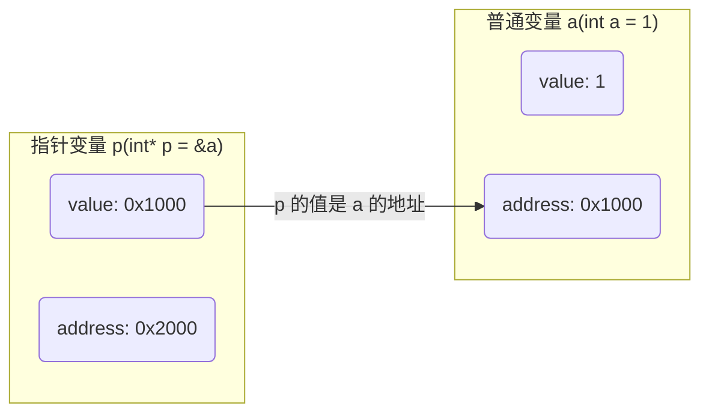

通过指针, 可间接访问或修改指针所指向变量的值(称为解引用), 而无需知道或依赖原变量名

- 双重属性

`pointer variable`本身也是一个变量(对象), 因此它同样具备标识符和内存地址, 并占用独立的内存空间

`pointer variable`的值: 存储目标变量的内存地址

`pointer variable`的地址: 是指针变量自身在内存中的物理/虚拟位置

## 基本操作

### 取地址(address of)

`&`运算符可获取变量地址, 常用于初始化指针变量

```c
#include <stdio.h>

int main() {
    int a = 1;

    // 将 a 的地址赋值给指针变量 p
    int *p = &a;

    // pointer p value = 0x7ffa2ed1128
    // variable a address = 0x7ffa2ed1128
    printf("pointer p value = %p\n", p);
    printf("variable a address = %p\n", &a);

    return 0;
}
```

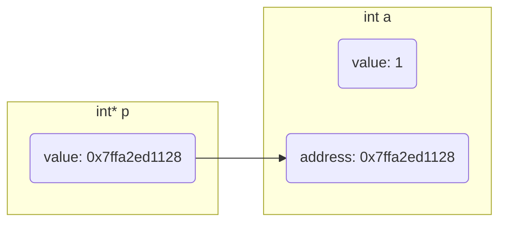

### 解引用(dereference)

`*` 运算符可访问指针变量指向的内存位置(对象), 称为解引用

```c
#include <stdio.h>

int main() {
    int a = 1;
    int *p = &a;

    // a value = 1
    // a address = 0x7ffc241ed608
    printf("a value: %d\na address: %p\n", a, &a);

    // p value = 0x7ffc241ed608
    // *p value = 1
    printf("p value: %p\n*p value: %d\n", p, *p);

    return 0;
}
```

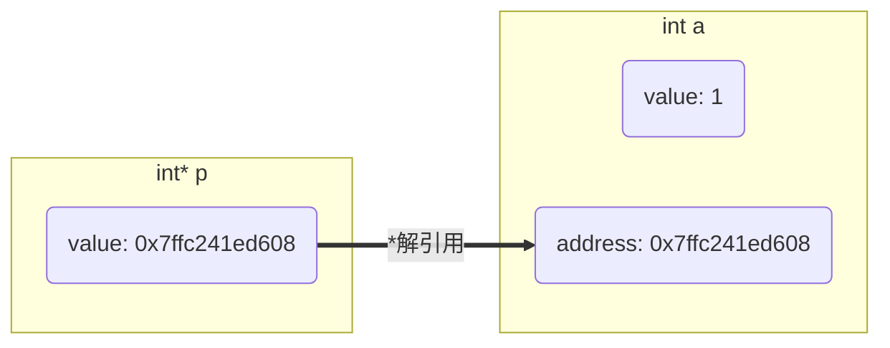

>⚠️ 重点辨析：星号 * 的双重身份
>
> 在变量声明时(如 `int *p;`), `*` 是类型说明符, 表示 p 是一个指针类型
> 
> 在表达式中(如 `*p = 10;`), `*` 是解引用运算符, 表示访问 p 指向的内存


## 属性

### 指针变量指向(指针值)

指针变量的值是其所存储的目标变量地址, 也称指针变量指向目标变量

```c++
#include <stdio.h>

int main() {
    int a = 10;
    int *p = &a;

    // a = 10, &a = 0x7ffff423e928
    printf("a = %d, &a = %p\n", a, &a);

    // *p = 10, p = 0x7ffff423e928
    printf("*p = %d, p = %p\n", *p, p);

    return 0;
}
```

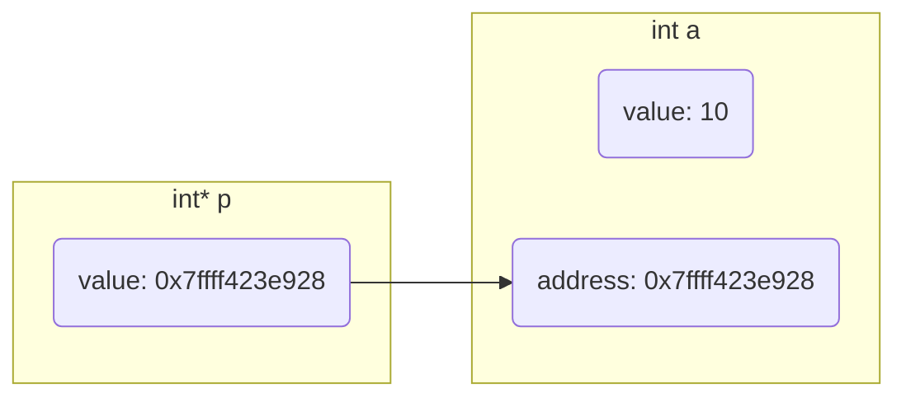

#### 改变指针变量指向

让指针变量存储一个新变量地址, 称为改变指针变量的指向

```c
#include <stdio.h>

int main() {
    int a = 255;
    int b = 170;
    int* p = &a;

    // p = 0x7fff62e598a8, *p = 255
    printf("p = %p, *p = %d\n", p, *p);

    // 改变指针指向
    p = &b;
    // p = 0x7fff62e5989c, *p = 170
    printf("p = %p, *p = %d\n", p, *p);

    return 0;
}
```

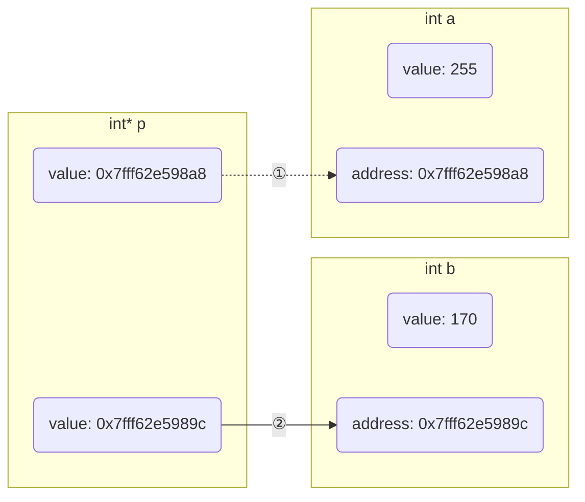

#### 间接修改变量值

通过指针变量存储的地址可以间接修改其指向变量的值

```c
#include <stdio.h>

int main() {
    int a = 255;
    int* p = &a;

    // p = 0x7ffc9fcdabf8, *p = 255
    // a = 255, &a = 0x7ffc9fcdabf8
    printf("p = %p, *p = %d\n", p, *p);
    printf("a = %d, &a = %p\n",a, &a);

    *p = 1;
    // p = 0x7ffc9fcdabf8, *p = 1
    // a = 1, &a = 0x7ffc9fcdabf8
    printf("p = %p, *p = %d\n", p, *p);
    printf("a = %d, &a = %p\n",a, &a);

    return 0;
}
```

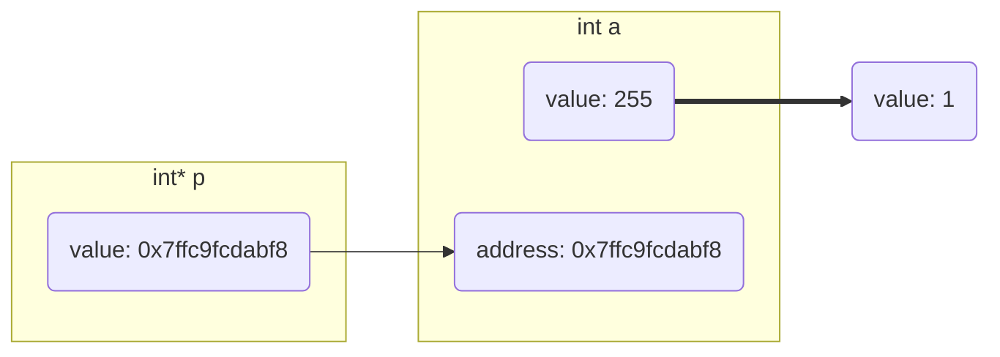

### 类型

指针变量去掉变量名后是指针类型

| 声明语句       | 指针类型    |  指针指向类型 | 说明
| ------------- | ----------- | ------------ | -------------------------------- |
| `int *p1`     | `int *`     | `int`        | 决定解引用时读取 4 字节并按整数解释 |
| `char *p2`    | `char *`    | `char`       | 决定解引用时读取 1 字节并按字符解释 |
| `double **p3` | `double **` | `double *`   | 指向类型本身也是一个指针           |

因为无论何类型指针都是存储地址值, 所以指针变量大小只与系统位数有关, 与类型无关 

$32$位系统指针大小为$4$字节, $64$位系统指针大小位$8$字节

```c
#include <stdio.h>

int main() {
    int* p = NULL;
    double* p1 = NULL;
    printf("sizeof p = %d\nsizeof p1 = %d\n", sizeof(p), sizeof(p1));

    return 0;
}
```

#### 指针操作的内存范围(步长与边界)

指针类型本身不包含连续内存的长度信息(数组指针除外)

指针变量只知道“指向类型的单个对象大小”, 并以此作为指针算术(如 p++)的步长

```c
// 指针变量指向4字节大小区域
int a = 1;
int *p = &a;
```

当指针变量指向动态分配的连续内存时, 指向区域的实际大小是由程序员的业务逻辑保证的, 编译器和指针类型本身不进行边界检查

```c++
// 指针变量指向1024 字节 大小区域
const int SIZE = 1024;
char *p =(char *)malloc(sizeof(char) * SIZE);
```

## 特殊指针变量

### pointer to const (指向常量的指针)

> `A pointer to a constant object.`

指针指向的对象是常量

不能通过该指针间接修改目标变量的值(指向的值不可变), 但指针本身可以改变指向

```c
const int *p

// 或
int const *p
```

指针类型 `int *`, 指针指向类型 `const int`

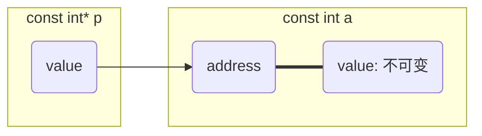

```c++
#include <stdio.h>

int main(void) {
    const int a = -1;
    const int b = 1;
    const int *p = &a;
    printf("%d\n", *p);

    // 尝试改变指针指向
    p = &b;
    printf("%d\n", *p);

    // 尝试改变指针指向值, 报错
    *p = -1;
    printf("%d\n", *p);

    return 0;
}
```

运行时报错

```sh
error: read-only variable is not assignable
```

### const pointer (常量指针)

> `A constant pointer to an object.`

指针本身是常量, 指针的指向在初始化后不可更改(指向不可变), 但可以通过该指针修改目标变量的值(指向的值可变)

```c
int *const p;
```

指针类型 `int *const`, 指针指向类型 `int`

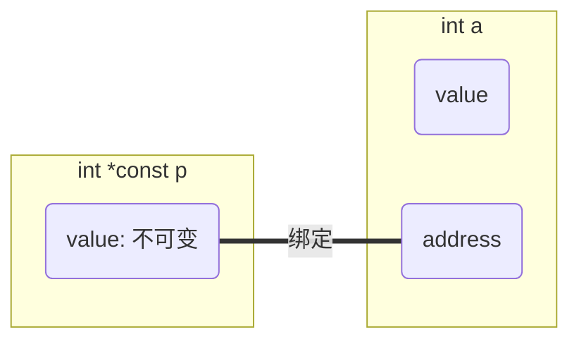

```c++
#include <stdio.h>

int main(void) {
    int a = -1;
    int *const p = &a;

    printf("%d\n", *p);
    // 尝试改变指针指向值
    *p = 1;
    printf("%d\n", *p);

    int b = 1;
    // 尝试改变指针指向, 报错
    p = &b;
    printf("%d\n", *p);

    return 0;
}
```

运行时报错

```sh
error: cannot assign to variable 'p' with const-quakufued type 'int *const'

note: variable 'p' declared const here
```

### function pointer(函数指针)

指向函数的指针, 存储函数入口地址, 通过函数指针可间接调用函数

```sh
返回值(*)(参数...,)
```

```c
#include <stdio.h>

int get_max(int x, int y) {
    return x > y ? x : y;
}

int main() {
    int(*p)(int, int) = NULL;
    p = get_max;

    // 2
    printf("%d\n", p(1, 2));

    return 0;
}
```

### array of pointers(指针数组)

指针数组是数组, 数组中元素为指针

```c
int *p[3];
```

指针类型 `int *`, 指针指向类型 `int`

```c
#include <stdio.h>

int main(void) {
    int *p[3];
    int a = 1;
    int b = 2;
    int c = 3;

    p[0] = &a;
    p[1] = &b;
    p[2] = &c;
    for(int i = 0; i < 3; i++) {
        // p[0] = 1, &p[0] = 0x7fffa48dbfd0
        // p[1] = 2, &p[1] = 0x7fffa48dbfd8
        // p[2] = 3, &p[2] = 0x7fffa48dbfe0
        printf("p[%d] = %d, &p[%d] = %p\n", i, *p[i], i, &p[i]);
    }

    return 0;
}
```

### pointer to pointer(二级指针)

指向指针的指针, 其值是另一个指针变量的地址。常用于在函数内部修改外部指针的指向, 或表示二维数组

```c
int **a;
```

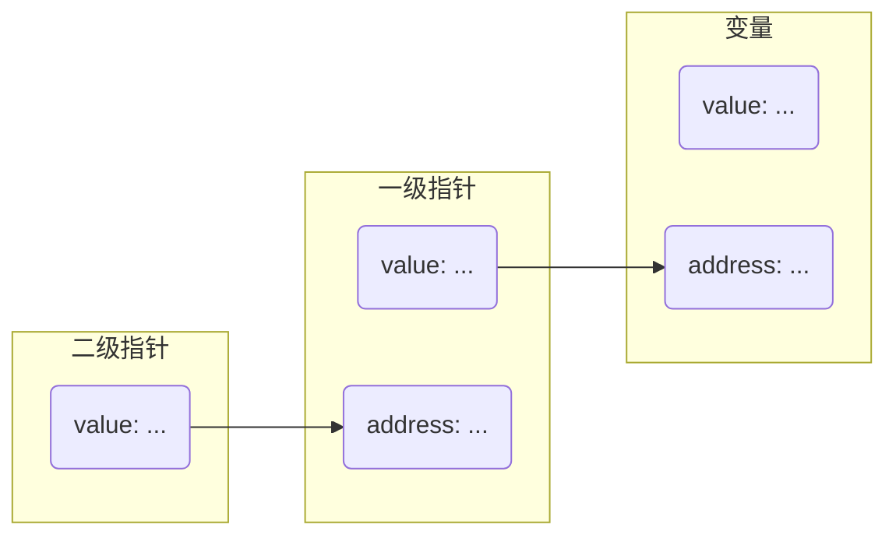

```c
#include <stdio.h>

int main() {
    int a = 1;
    int *p = &a;
    int **sp = &p;

    // a: 1
    // &a: 0x7ffd79d476d8
    printf("a: %d\n, &a: %p\n\n", a, &a);
    
    // *p: 1
    // p: 0x7ffd79d476d8
    // &p: 0x7ffd79d476d0
    printf("*p: %d\n, p: %p\n, &p: %p\n\n", *p, p, &p);

    // **sp: 1
    // *sp: 0x7ffd79d476d8
    // sp: 0x7ffd79d476d0
    printf("**sp: %d\n, *sp: %p\n, sp: %p\n", **sp, *sp, sp);

    return 0;
}
```

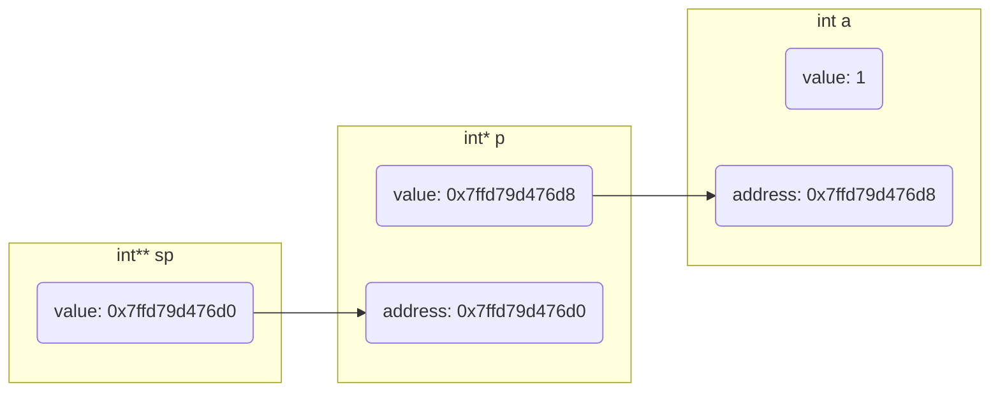

### pointer to array (数组指针)

该指针指向一个完整的数组(而非数组的首元素)

常用于多维数组传参

```c
int(*p)[3];
```

指针类型 `int *`, 指针指向类型 `int [3]`

```c
#include <stdio.h>

int main(void) {
    int a[3] = {1, 2, 3};
    int(*p)[3] = &a;

    for(int i = 0; i < 3; i++) {
        // &a[0] = 0x7ffdeaf17b0, a[0] = 1
        // &a[1] = 0x7ffdeaf17b4, a[1] = 2
        // &a[2] = 0x7ffdeaf17b8, a[2] = 3
        printf("&a[%d] = %p, a[%d] = %d\n", i, &a[i], i, a[i]);
    }
    for(int i = 0; i < 3; i++) {
        //(*p + 0) = 0x7ffdeaf17b0, *(*p + 0) = 1
        //(*p + 1) = 0x7ffdeaf17b4, *(*p + 1) = 2
        //(*p + 2) = 0x7ffdeaf17b8, *(*p + 2) = 3
        printf("(*p + %d) = %p, *(*p + %d) = %d\n", i,(*p + i), i,*(*p + i));
    }

    return 0;
}
```

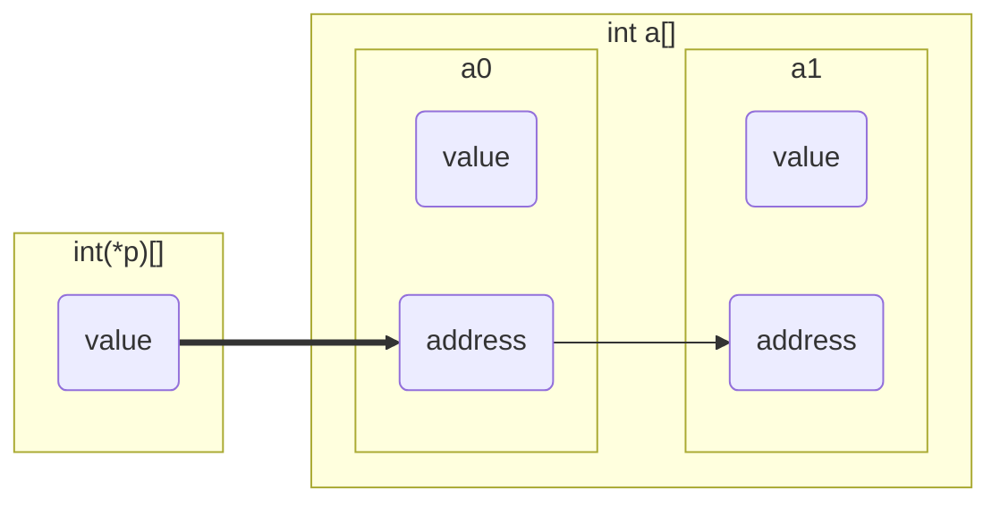


### pointer to object (对象指针)

在 `c++` 或 `c` 结构体中, 指向类或结构体实例的指针

除使用 `*` 解引用外, 还可用 `->` 运算符来简化成员访问

```c
#include <stdio.h>

struct Point {
    int x;
    int y;
};

int main() {
    struct Point pt = {10, 20};
    struct Point *p_pt = &pt;

    // 使用 -> 运算符访问对象成员, 等价于(*p_pt).x
    printf("x = %d, y = %d\n", p_pt->x, p_pt->y); 
    
    return 0;
}
```